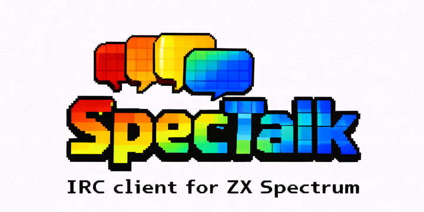
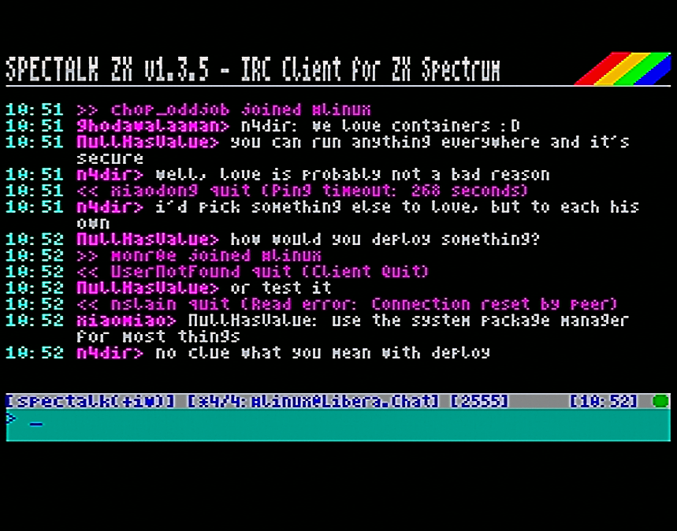
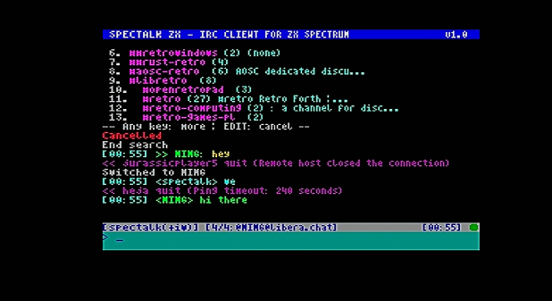
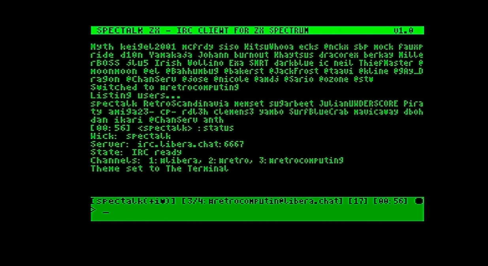
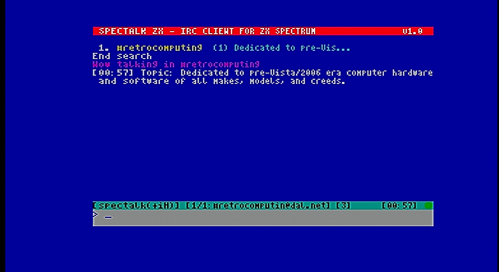

# SpecTalk ZX

**IRC Client for ZX Spectrum with ESP8266 WiFi**

🇪🇸 [Leer en español](READMEsp.md)


## Overview

SpecTalk ZX is a fully-featured IRC client that brings modern internet chat to the classic ZX Spectrum. Using an ESP8266 WiFi module for connectivity, it provides a complete IRC experience on 8-bit hardware with a 64-column display, multiple channel support, and visual themes.

[](images/snap1.png)


## Features

- **Full IRC Protocol Support**: JOIN, PART, QUIT, NICK, PRIVMSG, NOTICE, TOPIC, MODE, KICK, BAN, WHO, WHOIS, LIST, and more
- **64-Column Display**: Custom 4-pixel wide font for maximum text on screen
- **Multi-Window Interface**: Up to 10 simultaneous channel/query windows
- **Visual Themes**: 3 built-in color themes (Default, Terminal, Colorful)
- **NickServ Integration**: Automatic identification with stored password
- **CTCP Support**: VERSION, PING, TIME, ACTION responses
- **Channel User Counting**: Real-time user count with timeout handling
- **Search Functionality**: Search through message history
- **Keep-Alive System**: Automatic PING to prevent disconnection
- **Activity Indicators**: Visual notification for messages in inactive channels

[](images/theme 1.png) [](images/theme 2.png) [](images/theme 3.png)

## Hardware Requirements

### Option 1: divTIESUS / divMMC (Recommended)
- ZX Spectrum 48K/128K/+2/+3
- divTIESUS Maple Edition or compatible divMMC with UART
- ESP8266/ESP-12 module with AT firmware
- Hardware UART at 115200 baud

### Option 2: AY Bit-Bang
- ZX Spectrum 48K/128K/+2/+3
- ESP8266/ESP-12 module connected to AY-3-8912 port
- TX: Port A bit 3, RX: Port A bit 7
- Software UART at 9600 baud

## Installation

1. Download the appropriate TAP file for your hardware:
   - `SpecTalkZX.tap` - For divTIESUS/divMMC hardware UART
   - `SpecTalkZX_AY.tap` - For AY bit-bang UART

2. Load on your Spectrum using your preferred method (SD card, tape, etc.)

3. Configure your WiFi and IRC settings using the built-in commands

## Quick Start

```
!wifi SSID,password     Connect to WiFi network
!server irc.server.net  Set IRC server
!port 6667              Set IRC port (default: 6667)
!nick YourNick          Set your nickname
!connect                Connect to IRC server
/join #channel          Join a channel
```

## Commands Reference

### System Commands (!)

| Command | Description |
|---------|-------------|
| `!wifi SSID,pass` | Connect to WiFi network |
| `!server host` | Set IRC server address |
| `!port num` | Set IRC port |
| `!nick name` | Set nickname |
| `!pass password` | Set NickServ password |
| `!connect` | Connect to IRC server |
| `!disconnect` | Disconnect from server |
| `!init` | Re-initialize ESP8266 |
| `!theme [1-3]` | Change color theme |
| `!status` | Show connection status |
| `!help` | Show help |
| `!about` | About SpecTalk |
| `!quit` | Exit to BASIC |

### IRC Commands (/)

| Command | Description |
|---------|-------------|
| `/join #channel` | Join a channel |
| `/part [message]` | Leave current channel |
| `/msg nick text` | Send private message |
| `/me action` | Send action message |
| `/nick newnick` | Change nickname |
| `/topic [text]` | View/set channel topic |
| `/kick nick [reason]` | Kick user from channel |
| `/ban nick` | Ban user |
| `/mode +/-flags` | Set channel/user modes |
| `/who #channel` | List channel users |
| `/whois nick` | Get user info |
| `/list [pattern]` | List channels |
| `/names` | List users in channel |
| `/away [message]` | Set/clear away status |
| `/quote raw` | Send raw IRC command |

### Window Navigation

| Key | Action |
|-----|--------|
| `Tab` | Next window |
| `Shift+Tab` | Previous window |
| `Ctrl+1-9` | Jump to window 1-9 |
| `Ctrl+0` | Jump to window 10 |

## Building from Source

### Requirements
- z88dk (with SDCC)
- Make

### Build Commands

```bash
# Default build (divTIESUS/divMMC)
make

# AY bit-bang build
make ay

# Clean build artifacts
make clean
```

## Project Structure

```
SpecTalkZX/
├── src/
│   ├── spectalk.c      # Main module, UI, connection handling
│   ├── irc_handlers.c  # IRC protocol message parsing
│   └── user_cmds.c     # User command processing
├── asm/
│   ├── spectalk_asm.asm   # Optimized assembly routines
│   ├── ay_uart.asm        # AY bit-bang UART driver
│   └── divmmc_uart.asm    # divTIESUS hardware UART driver
├── include/
│   ├── spectalk.h      # Common header
│   ├── themes.h        # Color theme definitions
│   └── font64_data.h   # 4-pixel font data
├── Makefile
├── LICENSE
├── README.md
├── READMEsp.md
└── CHANGELOG.md
```

## Technical Details

- **Memory**: Fits in 48K, uses optimized ring buffer (2KB) for UART RX
- **Display**: Custom 64-column renderer with attribute caching
- **Protocol**: Full IRC tokenizer with table-driven command dispatch
- **Performance**: Critical paths optimized in Z80 assembly

## License

SpecTalk ZX is free software licensed under the **GNU General Public License v2.0**.

This project includes code derived from:
- **BitchZX** - IRC client (GPLv2)
- **AY/ZXuno UART driver** by Nihirash

See the [LICENSE](LICENSE) file for full license text.

## Author

**M. Ignacio Monge Garcia** - 2026

## Acknowledgments

- The BitchZX project for IRC protocol implementation inspiration
- Nihirash for the AY/ZXuno UART driver code
- The z88dk team for the excellent cross-compiler
- The ZX Spectrum retro computing community

---

*Connect your Spectrum to the world!*
