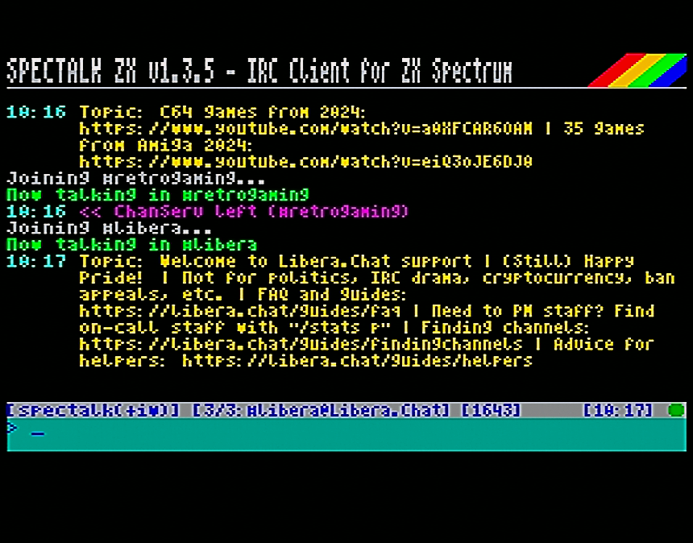
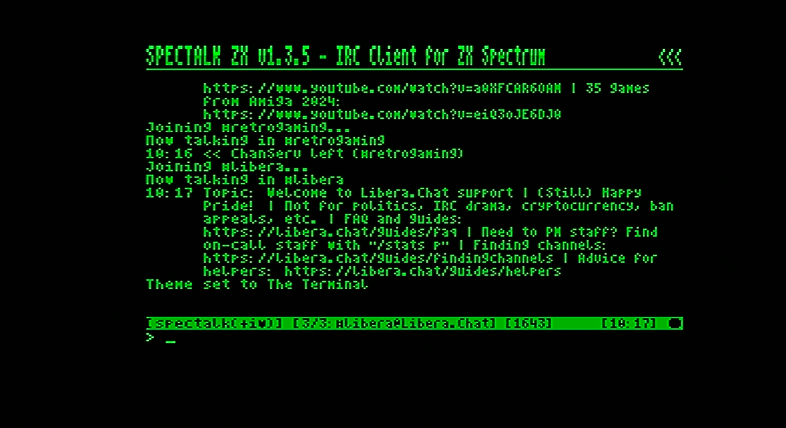
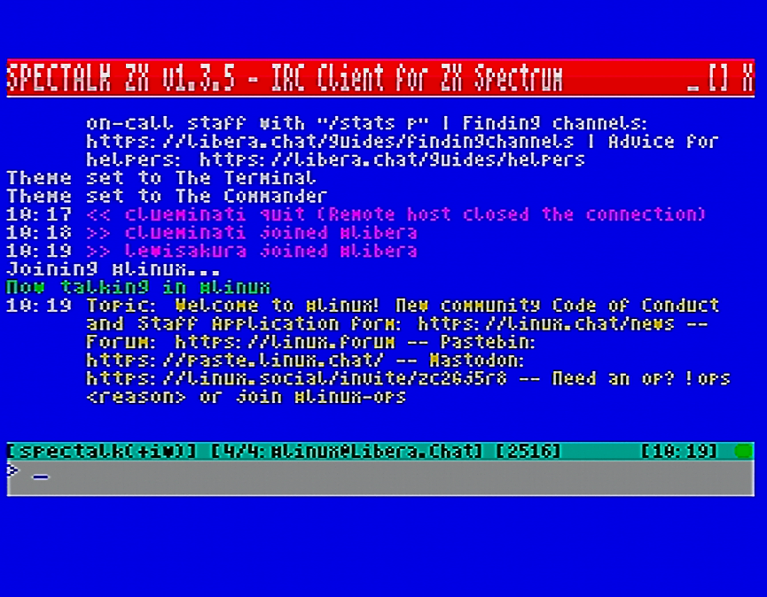

# SpecTalk ZX

**IRC Client for ZX Spectrum with ESP8266 WiFi**

🇪🇸 [Leer en español](READMEsp.md)


## Overview

SpecTalk ZX is a fully-featured IRC client for the ZX Spectrum. Using an ESP8266 WiFi module for connectivity, it provides a complete IRC experience on 8-bit hardware with a 64-column display and support for up to 10 simultaneous channel/query windows.

[](images/snap1.png)

## Features

- **64-column display** using custom 4-pixel wide font
- **Multi-window interface**: Up to 10 simultaneous channels/queries
- **3 color themes**: Default, Terminal, Colorful
- **NickServ integration**: Automatic identification
- **CTCP support**: VERSION, PING, TIME, ACTION
- **Channel user counting** with real-time updates
- **Search functionality**: Find channels or users by pattern
- **Keep-alive system**: Automatic PING to prevent timeout
- **Activity indicators**: Visual notification for unread messages

[](images/theme1.png) [](images/theme2.png) [](images/theme3.png)

## Hardware Requirements

### Option 1: divTIESUS / divMMC (Recommended)
- ZX Spectrum 48K/128K/+2/+3
- divTIESUS or divMMC with hardware UART
- ESP8266/ESP-12 module with AT firmware
- Hardware UART at 115200 baud

### Option 2: AY Bit-Bang
- ZX Spectrum 48K/128K/+2/+3
- ESP8266/ESP-12 connected to AY-3-8912 port
- Software UART at 9600 baud

## Installation

1. Download the TAP file for your hardware
2. Load on your Spectrum (SD card, tape, etc.)
3. Configure WiFi with [NetManZX](https://github.com/imnacio/netmanzx) or similar tool

## Quick Start

```
/nick YourNick          Set your nickname
/server irc.libera.chat Connect to server
/join #channel          Join a channel
```

Type `!help` for the built-in help system.

## Commands Reference

### System Commands (!)

| Command | Description |
|---------|-------------|
| `!help` or `!h` | Show help pages (press any key to switch pages, EDIT to exit) |
| `!status` or `!s` | Show connection status, nick, server, and open channels |
| `!init` or `!i` | Re-initialize ESP8266 module |
| `!theme N` | Change color theme (1-3) |
| `!about` | Show version and credits |

### IRC Commands (/)

#### Connection
| Command | Description |
|---------|-------------|
| `/nick name` | Set or change nickname |
| `/pass password` | Set NickServ password (sent on connect) |
| `/server host[:port]` | Connect to IRC server (default port: 6667) |
| `/quit [message]` | Disconnect from server |

#### Channels
| Command | Alias | Description |
|---------|-------|-------------|
| `/join #channel` | `/j` | Join a channel |
| `/part [message]` | `/p` | Leave current channel |
| `/topic [text]` | | View or set channel topic |
| `/names` | | List users in current channel |
| `/kick nick [reason]` | `/k` | Kick user from channel (requires op) |

#### Messages
| Command | Alias | Description |
|---------|-------|-------------|
| `/msg nick text` | `/m` | Send private message |
| `/query nick` | `/q` | Open query window for private chat |
| `/me action` | | Send action message (*YourNick does something*) |
| `nick: text` | | Quick PM syntax (from channel window) |

#### Windows
| Command | Description |
|---------|-------------|
| `/0` | Switch to Server window |
| `/1` to `/9` | Switch to channel/query window |
| `/w` or `/channels` | List all open windows |
| `/close` | Close current query window (or `/part` if channel) |

#### Search & Info
| Command | Alias | Description |
|---------|-------|-------------|
| `/search pattern` | | Search channels (`#pat`) or users (`nick`) |
| `/list [pattern]` | `/ls` | List channels matching pattern |
| `/who #channel` | | List users in a channel |
| `/whois nick` | `/wi` | Get user information |

#### Other
| Command | Description |
|---------|-------------|
| `/away [message]` | Set or clear away status |
| `/ignore nick` | Toggle ignore for a user |
| `/raw command` | Send raw IRC command |

## Keyboard

| Key | Function |
|-----|----------|
| **ENTER** | Send message or execute command |
| **EDIT** (CAPS+1) | Cancel current operation |
| **↑ / ↓** | Navigate command history |
| **← / →** | Move cursor in input line |
| **DELETE** (CAPS+0) | Delete character |

## Building from Source

### Requirements
- z88dk with SDCC
- Make

### Build

```bash
make              # divTIESUS/divMMC build
make ay           # AY bit-bang build  
make clean        # Clean build artifacts
```

## Project Structure

```
SpecTalkZX/
├── src/
│   ├── spectalk.c       # Main module, UI, connection
│   ├── irc_handlers.c   # IRC protocol parsing
│   └── user_cmds.c      # Command processing
├── asm/
│   ├── spectalk_asm.asm # Optimized assembly routines
│   ├── ay_uart.asm      # AY bit-bang UART driver
│   └── divmmc_uart.asm  # Hardware UART driver
├── include/
│   ├── spectalk.h       # Common header
│   ├── themes.h         # Color themes
│   └── font64_data.h    # 4-pixel font data
├── Makefile
├── CHANGELOG.md
└── LICENSE
```

## License

SpecTalk ZX is free software under **GNU General Public License v2.0**.

Includes code derived from:
- **BitchZX** - IRC client (GPLv2)
- **AY/ZXuno UART driver** by Nihirash

## Author

**M. Ignacio Monge Garcia** - 2026

## Acknowledgments

- BitchZX project for IRC protocol inspiration
- Nihirash for AY UART driver code
- z88dk team for the cross-compiler
- ZX Spectrum retro computing community

---

*Connect your Spectrum to the world!*
