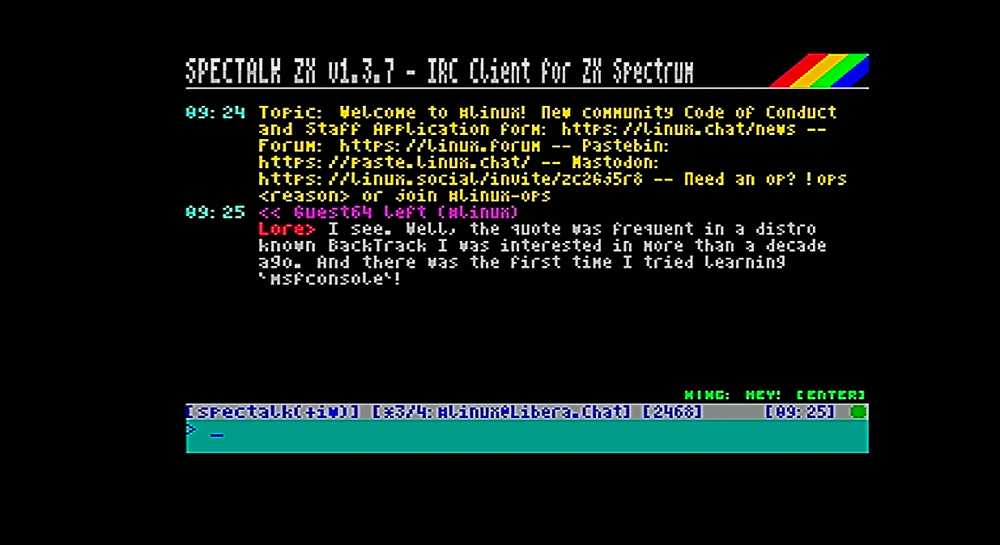
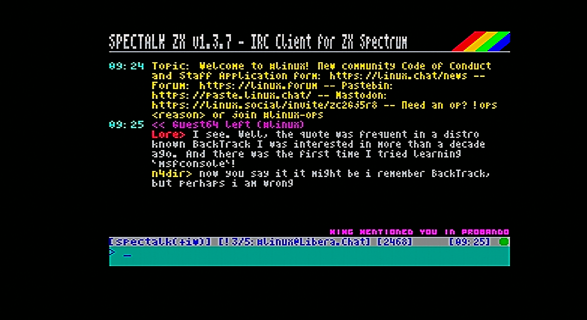
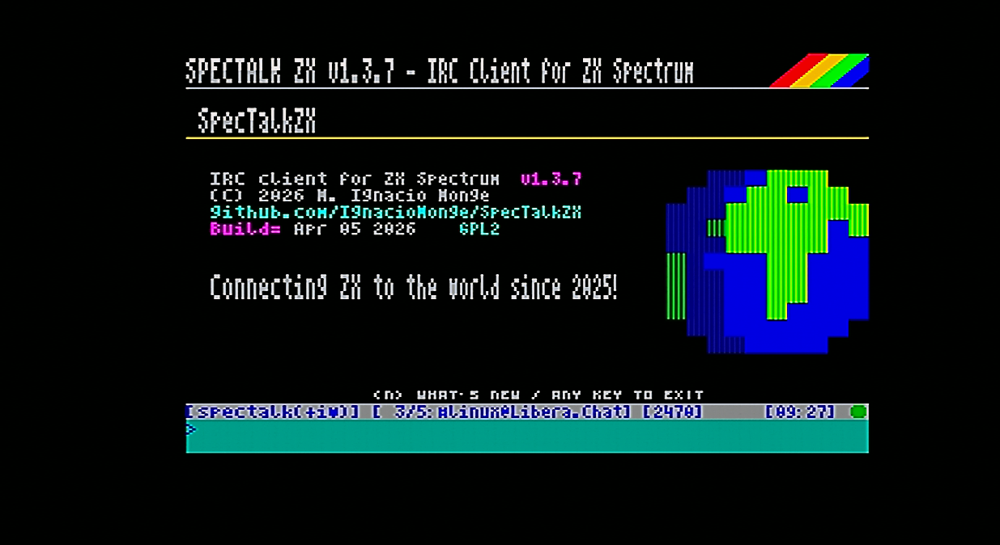
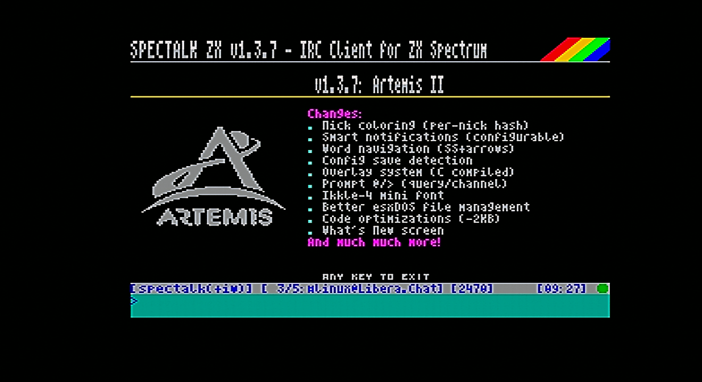
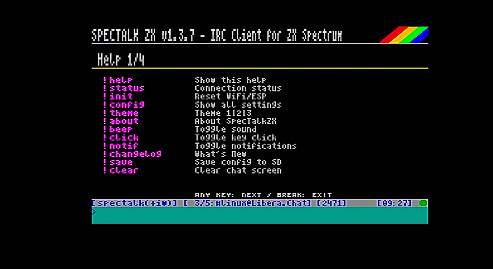
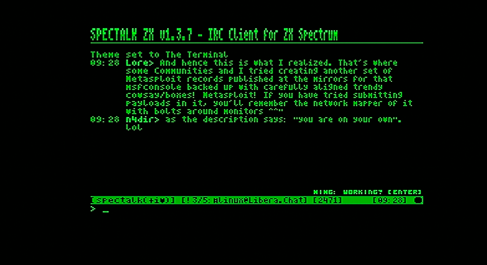
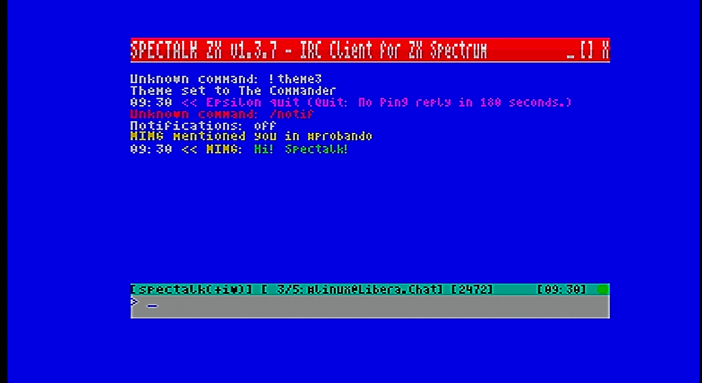
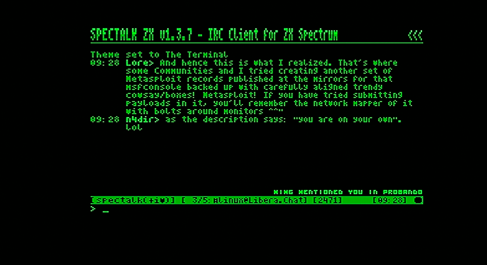
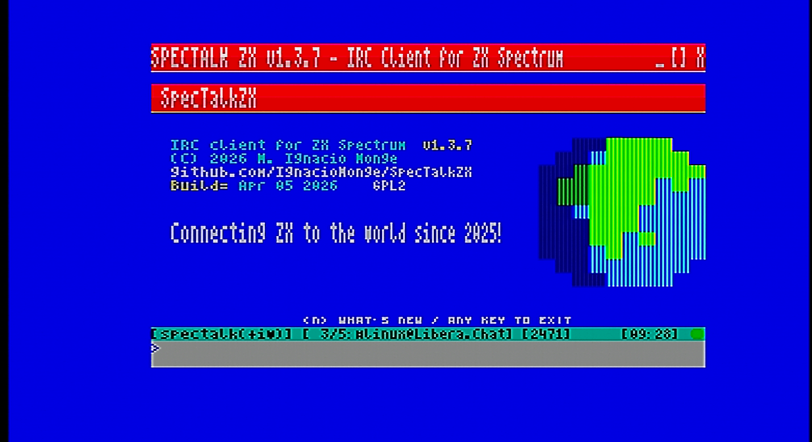

<p align="center">
  <a href="images/white_banner.png"></a>
</p>

# SpecTalk ZX

**IRC Client for ZX Spectrum with ESP8266 WiFi**

:es: [Leer en espanol](READMEsp.md)


---

## Overview

SpecTalk ZX is a fully-featured IRC client for the ZX Spectrum, bringing modern chat functionality to classic 8-bit hardware. Using an ESP8266 WiFi module for connectivity, it provides a complete IRC experience with a custom 64-column display, overlay-based UI screens, smart notifications, and support for up to 10 simultaneous channel and private message windows.

---

## Features

### Display & Interface
- **64-column display** with custom 4-pixel wide font for maximum text density
- **Multi-window interface** supporting up to 10 simultaneous channels/queries
- **3 color themes** with unique badge designs: Default (rainbow dither), Terminal (blinking `<<<`), Commander (`_ [] X`)
- **Nick coloring**: Hash-based per-nick color assignment for easy visual identification; auto-detects mono themes and disables gracefully. Toggle with `!nickcolor`
- **Double-height banner** with BRIGHT split effect (NetManZX style)
- **Activity indicators**: Visual markers for windows with unread messages, blinking badge on Theme 2
- **Mention highlighting**: Messages mentioning your nick rendered in BRIGHT; windows with mentions displayed in highlight color
- **Channel switcher bar**: Press EDIT for a visual tab overlay with live unread/mention indicators; DELETE closes selected channel
- **Connection indicator**: Three-state LED (red: No WiFi, yellow: WiFi OK, green: Connected)
- **Real-time clock** synchronized via SNTP
- **Optional timestamps** on all messages (off/on/smart cycle)

### Smart Notifications (Ikkle-4 Mini Font)
- **Ikkle-4 notification bar**: 4px-wide uppercase mini font renders alerts at screen row 20, outside the chat area
- **PM alerts**: Incoming private messages display sender nick in the notification bar
- **Nick mentions**: Alerts when someone mentions your nick in any channel
- **Friend notifications**: Alerts when a friend comes online or joins a channel
- **Quick reply**: Press ENTER during a PM notification to instantly open the sender's query window; BREAK dismisses
- **Configurable**: Toggle all notifications with `!notif on|off`
- **Beep differentiation**: Mention beep sounds at a lower pitch than the key click

### Overlay System
- **On-demand loading**: Help, About, Config, Status, and What's New screens are compiled C overlays loaded from `SPECTALK.OVL` on the SD card
- **About screen**: Version info, credits, and a rotating globe animation. Press N to view What's New
- **What's New screen**: Per-version changelog viewable from the About overlay
- **Help screens**: 4 pages of command reference (navigate with LEFT/RIGHT)
- **Config screen**: All current settings at a glance
- **Status screen**: Network info, server latency, uptime counter, and two-column channel list

### IRC Protocol
- **Full IRC compliance**: JOIN, PART, QUIT, NICK, PRIVMSG, NOTICE, TOPIC, MODE, KICK, WHO, WHOIS, LIST, NAMES
- **CTCP support**: VERSION, PING, TIME, ACTION
- **NickServ integration**: Quick identification with `/id` command or automatic with `nickpass=`
- **Away system**: Manual `/away` and automatic `!autoaway` with idle timer
- **User ignore**: Block messages from specific users with `/ignore`
- **Channel search**: Find channels or users by pattern
- **UTF-8 support**: International characters converted to readable ASCII

### Connectivity
- **Auto-connect**: Connect automatically to configured server on startup
- **Auto-identify**: Automatic NickServ identification after connect
- **Friends system**: Monitor up to 5 friends' online status with notifications
- **Nick collision handling**: Automatic alternate nick if primary is in use
- **Keep-alive system**: Automatic PING to detect silent disconnections
- **Ping latency**: Server response time measurement

### Input & Editing
- **Word navigation**: SS+LEFT / SS+RIGHT to jump word-by-word through input
- **Word delete**: SS+BACKSPACE (SS+DELETE) deletes the word behind the cursor
- **Key auto-repeat**: All keys repeat when held (400ms initial delay, ~17 chars/s rate)
- **Command history**: UP/DOWN arrows recall previous commands

### Performance & Low-Level
- **Overlay system**: C-compiled overlay modules loaded into ring buffer from SD card on demand
- **BPE string compression**: 155 screen strings compressed with 81 tokens (~947 bytes saved)
- **35 custom peephole rules**: Subroutine factoring and pattern optimization across 200+ call sites
- **Unity Build Architecture**: Entire client compiled as single unit for maximum cross-function optimization
- **Ring Buffer**: 2KB buffer for reliable high-speed data reception
- **13 hand-optimized ASM functions**: Frameless callee-convention routines for critical rendering and input paths
- **Hardware UART**: 115200 baud via divMMC/divTIESUS
- **esxDOS required**: Fatal halt with ROM messages if divMMC is missing or `SPECTALK.DAT` not found

A live IRC session on Libera Chat, showing nick coloring and timestamps:

<p align="center">
  <a href="images/chat_default.png"></a>
</p>

Mention notification displayed in the Ikkle-4 mini font at row 20:

<p align="center">
  <a href="images/chat_mention.png"></a>
</p>

The About screen with rotating globe (Theme 1) and What's New changelog:

<p align="center">
  <a href="images/about_globe.png"></a>
  &nbsp;&nbsp;
  <a href="images/whatsnew.png"></a>
</p>

Help page 1/4 and the configuration display:

<p align="center">
  <a href="images/help.png"></a>
  &nbsp;&nbsp;
  <a href="images/config.png"></a>
</p>

---

## Hardware Requirements

| Component | Specification |
|-----------|---------------|
| **Computer** | ZX Spectrum 48K, 128K, +2, +2A, +3, or compatible |
| **WiFi Module** | ESP8266 (ESP-01 or similar) with AT firmware |
| **Interface** | divMMC or divTIESUS (hardware UART) |
| **Baud Rate** | **115200** bps |
| **SD Card** | Required (esxDOS) for font data, overlays, and config |

> **Important**: Configure your ESP8266 to 115200 baud before use.

---

## Installation

1. Download `spectalk_divmmc.zip` from the [Releases](https://github.com/IgnacioMonge/SpecTalkZX/releases) page
2. Extract and copy all three files to your SD card:
   - `SpecTalkZX.tap` -- the program
   - `SPECTALK.DAT` -- font, themes and compressed string data
   - `SPECTALK.OVL` -- overlay modules for Help, About, Config, Status, and What's New screens
3. All three files must be in the same directory on the SD card
4. Load on your Spectrum via SD card, tape, or other method
5. Configure WiFi credentials using [NetManZX](https://github.com/IgnacioMonge/NetManZX) or similar tool

> **Important**: `SPECTALK.DAT` and `SPECTALK.OVL` are required. Without the DAT file the client will halt at startup. Without the OVL file the help, about, config, and status screens will not be available.

---

## Quick Start

1. **Initialize**: On startup, wait for `WiFi:OK` in the status bar (indicator turns yellow, then green when connected)

2. **Set nickname**:
   ```
   /nick YourNickname
   ```

3. **Connect to server**:
   ```
   /server irc.libera.chat 6667
   ```

4. **Join a channel**:
   ```
   /join #spectrum
   ```

5. **Start chatting!** Type your message and press ENTER

The three built-in color themes, each with a unique badge design:

<p align="center">
  <a href="images/chat_default.png"></a>
  &nbsp;&nbsp;
  <a href="images/theme_terminal.png"></a>
  &nbsp;&nbsp;
  <a href="images/theme_commander.png"></a>
  <br>
  <em>Default &nbsp;&nbsp;&nbsp;&nbsp;&nbsp;&nbsp;&nbsp;&nbsp;&nbsp;&nbsp;&nbsp;&nbsp;&nbsp;&nbsp;&nbsp;&nbsp;&nbsp;&nbsp;&nbsp;&nbsp;&nbsp;&nbsp;&nbsp;&nbsp;&nbsp; Terminal &nbsp;&nbsp;&nbsp;&nbsp;&nbsp;&nbsp;&nbsp;&nbsp;&nbsp;&nbsp;&nbsp;&nbsp;&nbsp;&nbsp;&nbsp;&nbsp;&nbsp;&nbsp;&nbsp;&nbsp;&nbsp;&nbsp;&nbsp;&nbsp;&nbsp; Commander</em>
</p>

Theme 2 (Terminal) with a mention notification in the Ikkle-4 bar and the About screen in Commander theme:

<p align="center">
  <a href="images/theme_terminal_notif.png"></a>
  &nbsp;&nbsp;
  <a href="images/about_commander.png"></a>
</p>

---

## Command Reference

### Keyboard Controls

| Key | Action |
|-----|--------|
| **ENTER** | Send message or execute command |
| **EDIT** (Caps+1) | Open/close channel switcher bar |
| **DELETE** (Caps+0) | Delete character (backspace) |
| **< / >** | Move cursor within input line |
| **up / down** | Navigate command history |
| **SS+<** / **SS+>** | Word-by-word navigation |
| **SS+DELETE** | Delete word behind cursor |
| **BREAK** (Caps+Space) | Exit overlays / dismiss notification |
| **ENTER** (on PM notification) | Open sender's query window |

### System Commands (!)

Local commands that don't require server connection.

| Command | Alias | Description |
|---------|-------|-------------|
| `!help` | `!h` | Show help screens (4 pages) |
| `!status` | `!s` | Show connection info, latency, uptime |
| `!init` | `!i` | Reinitialize ESP8266 module |
| `!config` | `!cfg` | Show current configuration values |
| `!theme N` | -- | Change color theme (1, 2, or 3) |
| `!about` | -- | Version, credits, rotating globe |
| `!beep` | -- | Toggle mention sound (on/off) |
| `!notif` | `!nf` | Toggle notifications (on/off) |
| `!changelog` | -- | Show What's New screen |
| `!autoaway` | `!aa` | Set auto-away after N minutes (1-60, 0=off) |
| `!traffic` | -- | Toggle display of JOIN/QUIT messages |
| `!timestamps` | `!ts` | Cycle timestamp mode (off/on/smart) |
| `!clear` | `!cls` | Clear chat area |
| `!save` | `!sv` | Save current configuration to SD card |
| `!autoconnect` | `!ac` | Toggle auto-connect on startup |
| `!tz [+/-N]` | -- | View or set timezone offset (UTC -12 to +12) |
| `!friend [nick]` | -- | List friends, or toggle add/remove (max 5) |
| `!nickcolor` | `!nc` | Toggle nick coloring (on/off) |
| `!click` | -- | Toggle key click sound (on/off) |

### IRC Commands (/)

#### Connection

| Command | Alias | Description |
|---------|-------|-------------|
| `/server host [port]` | `/connect` | Connect to IRC server (default port: 6667) |
| `/nick [name]` | -- | View current or set new nickname |
| `/pass [password]` | -- | View, set or clear (`none`) server password |
| `/id [password]` | -- | Identify with NickServ (uses saved password if none given) |
| `/quit [message]` | -- | Disconnect from server with optional message |

#### Channels

| Command | Alias | Description |
|---------|-------|-------------|
| `/join #channel` | `/j` | Join a channel |
| `/part [message]` | `/p` | Leave current channel |
| `/topic [text]` | -- | View or set channel topic |
| `/names` | -- | List users in current channel |
| `/kick nick [reason]` | `/k` | Kick user from channel (ops only) |

#### Messages

| Command | Alias | Description |
|---------|-------|-------------|
| `/msg nick text` | `/m` | Send private message |
| `/query nick` | `/q` | Open private message window |
| `/close` | -- | Close current window |
| `/me action` | -- | Send action (appears as *YourNick action*) |

#### Windows

| Command | Alias | Description |
|---------|-------|-------------|
| `/0` ... `/9` | -- | Switch to window by number (0 = server) |
| `/channels` | `/w` | List all open windows (mentions highlighted) |

#### Tools

| Command | Alias | Description |
|---------|-------|-------------|
| `/search pattern` | -- | Search channels (`#pattern`) or users (`pattern`) |
| `/list pattern` | `/ls` | List channels matching pattern |
| `/who pattern` | -- | Search users matching pattern |
| `/whois nick` | `/wi` | Get information about a user |
| `/ignore [nick]` | -- | Toggle ignore for nick, or list ignored |
| `/raw command` | -- | Send raw IRC command to server |

#### Away Status

| Command | Alias | Description |
|---------|-------|-------------|
| `/away [message]` | -- | Set away status with message, or clear if no message |

> **Auto-away behavior**: When enabled via `!autoaway N`, automatically sets you away after N minutes of inactivity. Sending any message clears auto-away. Manual `/away` must be cleared manually with `/away`.

---

## Window Management

SpecTalk supports up to 10 simultaneous windows:

- **Window 0**: Server messages (always present)
- **Windows 1-9**: Channels and private queries

### Navigation
- Use `/0` through `/9` to switch windows
- Use `/w` or `/channels` to see all open windows
- Press **EDIT** to open the **channel switcher bar** -- a visual tab overlay showing all active channels. Use LEFT/RIGHT to navigate, ENTER to select, or digit keys for direct access. Auto-hides after 20 seconds.
- Activity indicator shows windows with unread messages
- Mention indicator shows windows where your nick was mentioned (highlighted in color)

### Private Messages
- Incoming PMs automatically create a query window and trigger a notification in the Ikkle-4 bar
- Press **ENTER** while the PM notification is visible to jump directly to that sender's window
- Press **BREAK** to dismiss the notification without switching
- Use `/query nick` to manually open a private chat
- Use `/close` to close the current query window

---

## Configuration File

SpecTalk can load settings from a configuration file on your SD card. The file should be named `SPECTALK.CFG` and placed in the `SYS/CONFIG/` directory. Use `!save` to write your current settings to this file.

### File Format

Plain text file with one setting per line in `key=value` format:

```
nick=MyNickname
server=irc.libera.chat
port=6667
nickpass=mynickservpassword
autoconnect=1
theme=1
timestamps=1
autoaway=15
beep=1
traffic=1
tz=1
notif=1
nickcolor=0
click=1
friends=Friend1,Friend2,Friend3
ignores=Troll1,Troll2
```

### Available Settings

| Setting | Description | Values | Default |
|---------|-------------|--------|---------|
| `nick` | Default nickname | Any valid IRC nick | (none) |
| `server` | IRC server hostname | Hostname or IP | (none) |
| `port` | Server port | 1-65535 | 6667 |
| `pass` | Server password | Any string | (none) |
| `nickpass` | NickServ password | Any string | (none) |
| `nickserv` | NickServ service nick override | Any nick | (auto) |
| `autoconnect` | Connect on startup | 0 or 1 | 0 |
| `theme` | Color theme | 1, 2, or 3 | 1 |
| `timestamps` | Show timestamps | 0, 1, or 2 (smart) | 1 |
| `autoaway` | Auto-away minutes | 0-60 (0=off) | 0 |
| `beep` | Sound on mention | 0 or 1 | 1 |
| `traffic` | Show quit/join messages | 0 or 1 | 1 |
| `tz` | Timezone offset | -12 to +12 | 1 |
| `notif` | Show notifications | 0 or 1 | 1 |
| `nickcolor` | Nick coloring | 0 or 1 | 0 |
| `click` | Key click sound | 0 or 1 | 1 |
| `friends` | Friend nicks to monitor (comma-separated, max 5) | nick1,nick2,... | (none) |
| `ignores` | Ignored nicks (comma-separated, max 5) | nick1,nick2,... | (none) |

### Viewing Current Configuration

Use `!config` or `!cfg` to display all current configuration values. Use `!save` to persist changes to the SD card.

---

## Status Bar

The status bar displays connection state, channel info, and clock in the following format:

```
[nick(+modes)] [idx/total:channel(@network)(+chanmodes)] [users]    [HH:MM] [LED]
```

| Element | Description |
|---------|-------------|
| **nick(+modes)** | Your current nickname and user modes (if any) |
| **idx/total:channel** | Window index, total windows, and current channel name |
| **@network** | Network name (if available) |
| **+chanmodes** | Channel modes (if any) |
| **users** | Number of users in the current channel |
| **HH:MM** | Current time (SNTP synchronized), displayed at the right |
| **LED** | Connection indicator at far right: red = No WiFi, yellow = WiFi OK, green = Connected |

When away, the indicator changes from a solid circle to a half-circle.

---

## Building from Source

### Requirements
- **z88dk** with SDCC support
- **GNU Make**

### Build Commands

```bash
# Standard build (divMMC/divTIESUS - 115200 baud)
make

# Release build with full optimization
make release

# Clean build artifacts
make clean
```

The project uses **Unity Build** strategy: all C sources are compiled as a single unit (`main_build.c`) enabling aggressive cross-function optimization.

---

## Troubleshooting

| Problem | Solution |
|---------|----------|
| Indicator stays red | Check ESP8266 wiring and baud rate configuration |
| Indicator yellow but won't connect | Verify WiFi credentials with NetManZX |
| Halts at startup ("esxDOS not found") | A divMMC-compatible interface with SD card is required |
| Halts at startup ("DAT not found") | Place `SPECTALK.DAT` in the same directory as the TAP |
| "Connection timeout" after idle | Normal behavior -- keep-alive detected dead connection |
| Messages from user won't stop | Use `/ignore nick` to block them |
| Can't identify with NickServ | Use `/id password` or set `nickpass=` in config file |
| Forgot current settings | Use `!config` to view all configuration values |
| Too many quit messages | Use `!traffic` to toggle them off |
| No sound on mentions | Use `!beep` to toggle sound on |
| Nick in use on connect | SpecTalk auto-adds `_` -- use `/nick` to change after |
| Accented characters look wrong | UTF-8 is auto-converted to ASCII equivalents |
| Help/About/Status not loading | Ensure `SPECTALK.OVL` is on the SD card alongside the TAP |
| Nick colors not visible | Use `!nickcolor` to enable; auto-disabled on mono themes |

---

## License

SpecTalk ZX is free software released under the **GNU General Public License v2.0**.

Includes code derived from:
- **BitchZX** -- IRC client (GPLv2)
- **UART driver** by Nihirash

---

## Author

**M. Ignacio Monge Garcia** -- 2025-2026

---

## Acknowledgments

- BitchZX project for IRC protocol foundation
- Nihirash for the UART driver code
- Jack Oatley for the Ikkle-4 mini font (public domain)
- z88dk team for the cross-compiler toolchain
- ZX Spectrum retro computing community

---

*Connecting the ZX Spectrum to IRC since 2025*
