<p align="center">
  <a href="images/white_banner.png"></a>
</p>

# SpecTalkZX

**IRC client for ZX Spectrum with ESP8266 WiFi**

:es: [Leer en espanol](READMEsp.md)


SpecTalkZX 1.3.8: Hermes is the largest quality and maturity jump since the first public release. It keeps the 48K-friendly target while adding a bookmark manager, restored IRC sessions, RTC clock mode, a safer IRC parser, better `/names` and `/list` handling, smoother text rendering, faster overlay loading, and a much larger overlay/data asset set.

---

## Highlights in 1.3.8

- **IRC bookmark manager**: `!bm` opens five SD-backed session slots. Store, connect, delete, and mark a slot for automatic connect/autojoin.
- **Session restore**: `!save` persists the server, port, active channels, and startup policy. `!autoconnect` controls server login; `!autojoin` controls saved channel replay after IRC registration.
- **Safer bookmark channels**: bookmark channel snapshots are isolated per slot, fixing the old class of mistakes where one bookmark could reuse channels from another saved session.
- **RTC clock source**: `!tz rtc` can seed the clock from local RTC sources via the cold RTC overlay, with SNTP still available for normal ESP8266 setups.
- **New IRC commands**: `/mode`, `/reply`, and `/notice` are now first-class commands. `/0` to `/9` switch directly to window slots.
- **Better `/names`**: manual names lists own the main area, render as a fixed four-column grid, support paging/cancel, and avoid stale backlog being printed under an incomplete list.
- **Optional user-count resync**: `!countsync` enables a lightweight idle count refresh after long multi-channel sessions.
- **Channel context dividers**: `!divider` toggles visual separators when the display switches between channel contexts.
- **Improved search and list UX**: search output no longer collides with the input prompt and throttles repeated/rapid visual updates.
- **Smarter NickServ handling**: auto-identify handles non-standard service names such as `NiCK` as well as `NickServ`.
- **Keepalive during About**: the animated `!about` screen keeps parsing PING/PONG traffic so long overlay viewing does not create false disconnects.
- **Faster rendering**: safe mid-line ASCII chunks use the fast 64-column row renderer, while BPE, wrapping, control characters, and odd-column cases keep the original path.
- **Faster overlay loading**: the overlay atlas, header validation, seek/read path, and fixed-size data generation were reworked and hardened.
- **More robust text handling**: UTF-8/Latin-1 display conversion, IRC format stripping, fallback output, prompt capture, and overlay exit RX cleanup were audited and corrected.
- **Large internal hardening pass**: the resident code, data generator, renderer, parser, and receive paths were reorganized and audited while keeping the 48K target.

See [CHANGELOG.md](CHANGELOG.md) for detailed release history, bug fixes, rejected prototypes, and final build metrics.

---

## Screenshots

<p align="center">
  <a href="images/snapshot-01.png">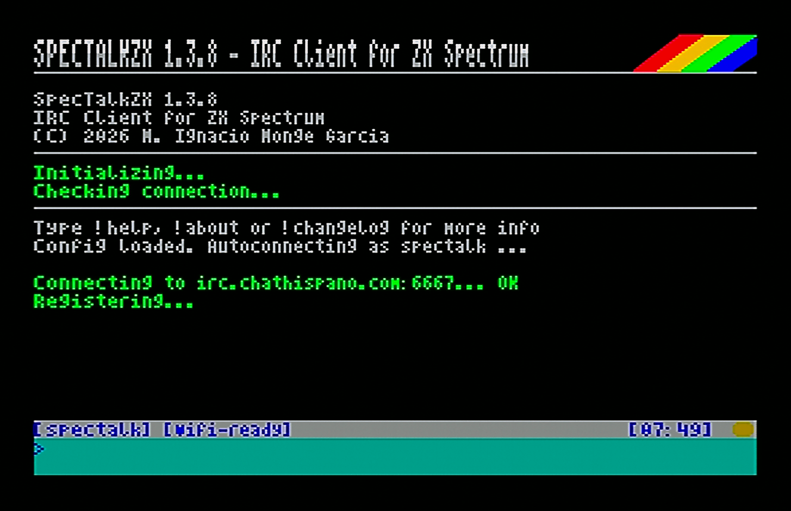</a>
  <a href="images/snapshot-02.png">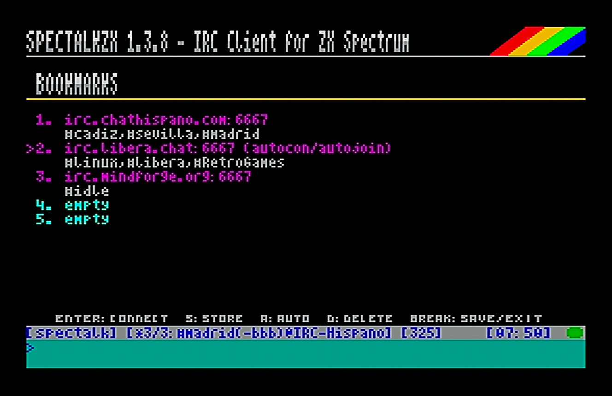</a>
  <a href="images/snapshot-03.png">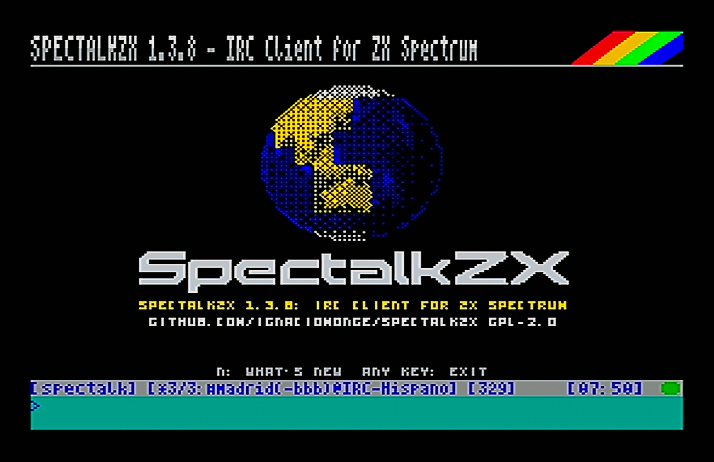</a>
</p>
<p align="center">
  <a href="images/snapshot-04.png">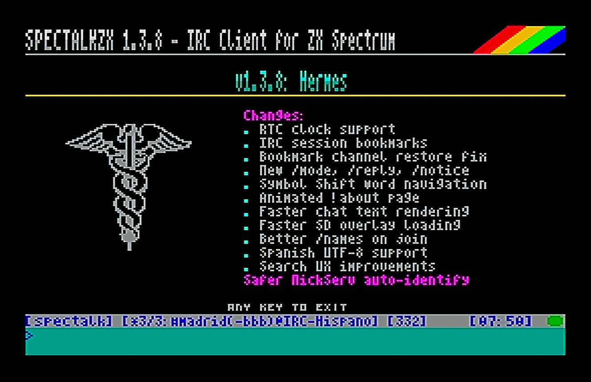</a>
  <a href="images/snapshot-05.png">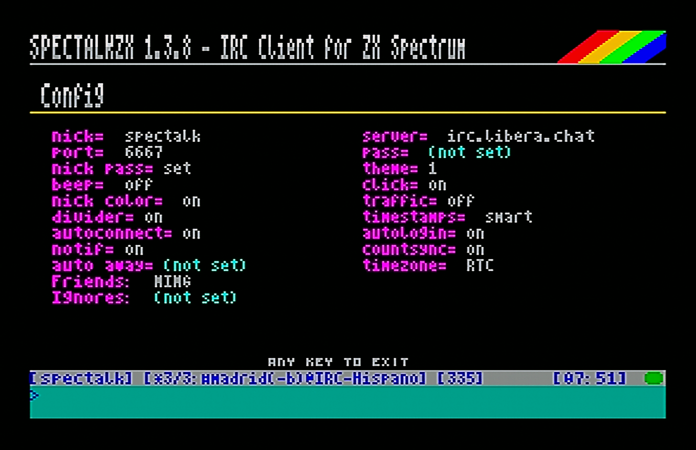</a>
  <a href="images/snapshot-06.png">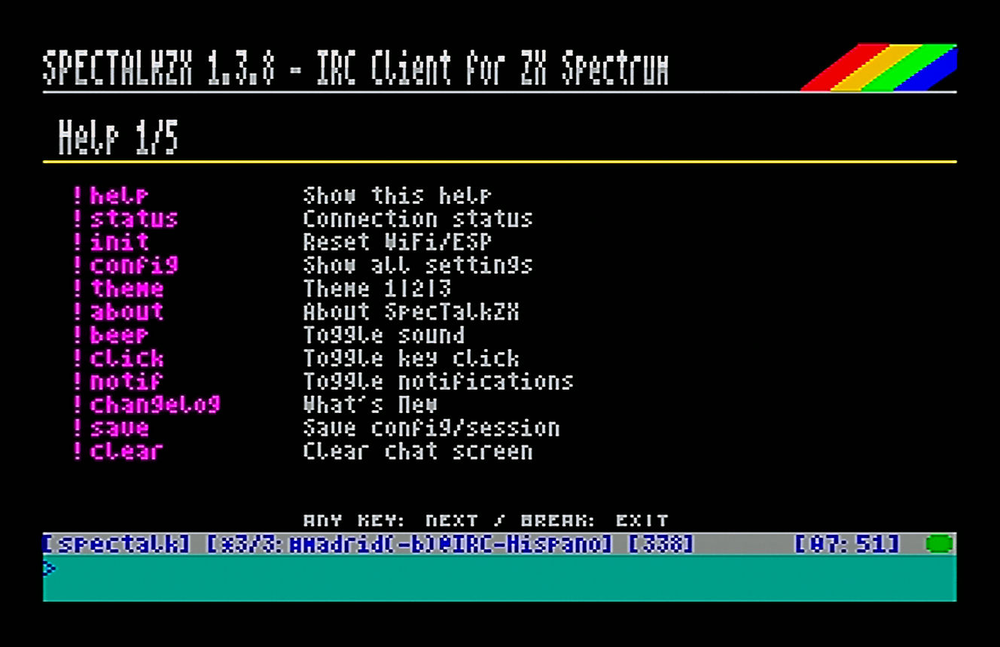</a>
</p>
<p align="center">
  <a href="images/snapshot-07.png">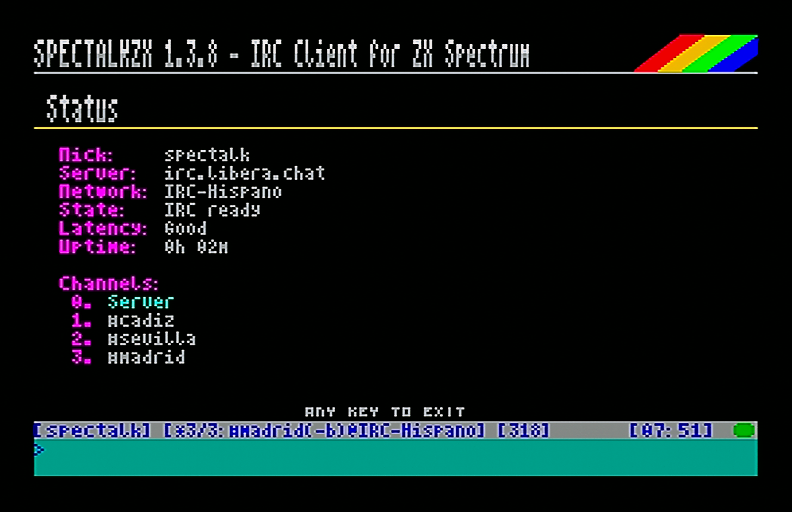</a>
  <a href="images/snapshot-08.png">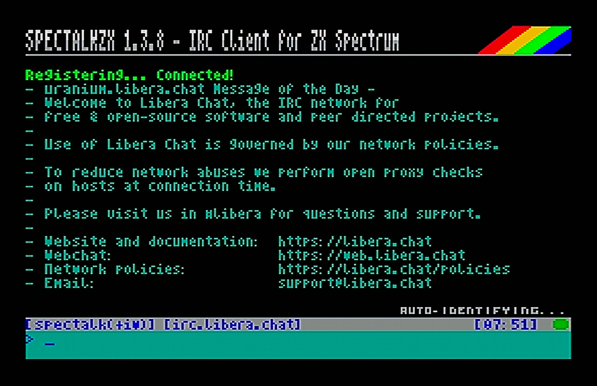</a>
  <a href="images/snapshot-09.png">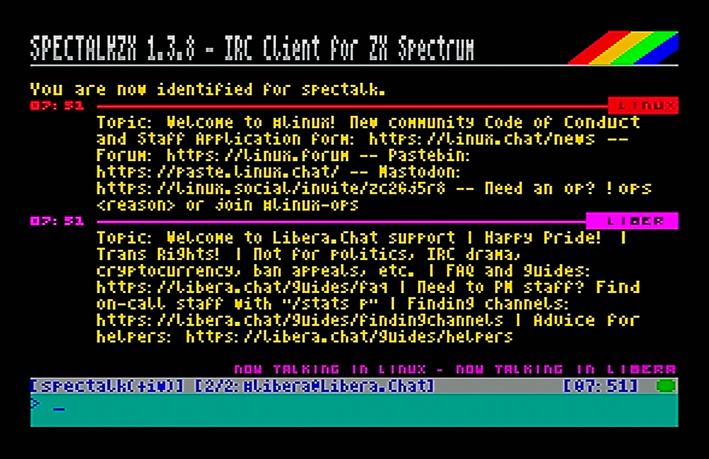</a>
</p>
<p align="center">
  <a href="images/snapshot-10.png">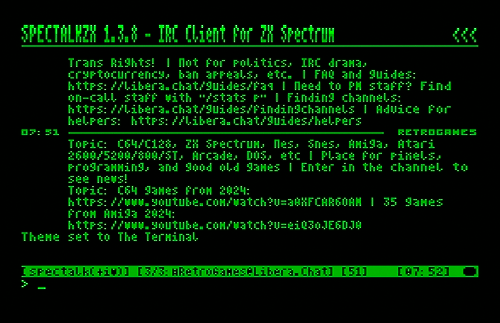</a>
  <a href="images/snapshot-11.png">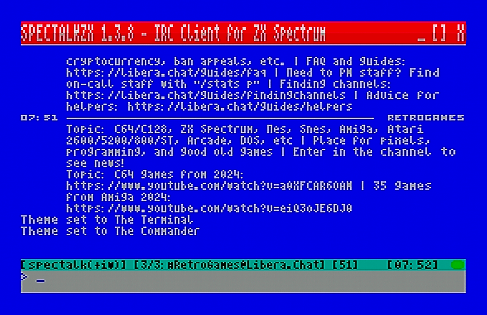</a>
  <a href="images/snapshot-12.png">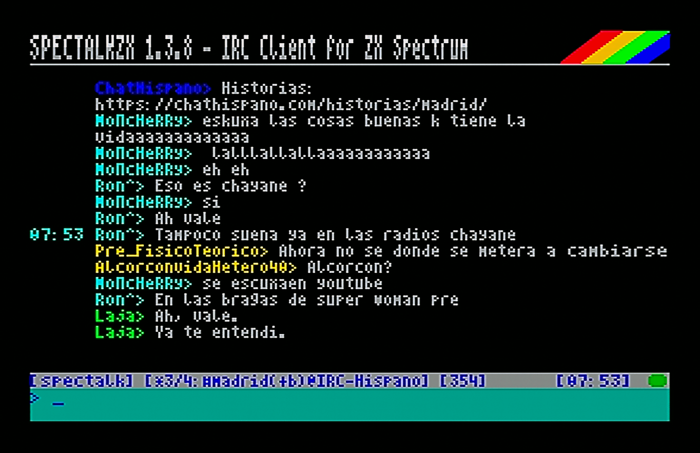</a>
</p>

---

## Requirements

| Component | Requirement |
|-----------|-------------|
| Computer | ZX Spectrum 48K, 128K, +2, +2A, +3, or compatible |
| Storage | divMMC/esxDOS-compatible SD storage |
| Network | ESP8266 or compatible ESP-AT WiFi bridge |
| UART | Supported 115200 baud hardware UART path, such as divMMC/divTIESUS-class hardware |
| Release files | `SpecTalkZX.tap`, `SPECTALK.OVL`, and `SPECTALK.DAT` kept together |

Configure the ESP8266 for **115200 baud** before use. WiFi credentials are normally configured with [NetManZX](https://github.com/IgnacioMonge/NetManZX) or an equivalent ESP-AT setup tool.

---

## Installation

1. Download the release archive from the [Releases](https://github.com/IgnacioMonge/SpecTalkZX/releases) page.
2. Copy all three files to the same directory on the SD card:
   - `SpecTalkZX.tap` - the loader/program.
   - `SPECTALK.OVL` - overlay code for help, About, bookmarks, RTC, config, status, local commands, and related screens.
   - `SPECTALK.DAT` - font, compressed strings, help text, themes, What's New, and About/Earth assets.
3. Load `SpecTalkZX.tap` on the Spectrum.
4. Wait for `WiFi:OK` in the status bar, then connect to IRC.

`SPECTALK.DAT` and `SPECTALK.OVL` are required. Stale or missing data files can break help, About, config, bookmarks, or other overlay screens.

---

## Quick Start

```text
/nick YourNick
/server irc.libera.chat 6667
/join #spectrum
```

Useful first setup:

```text
!theme 1
!timestamps smart
!notif on
!nickcolor on
!save
```

To save a complete session, open `!bm`. In bookmarks: **UP/DOWN** selects a slot, **S** stores the current server/channel snapshot, **A** marks it for startup, **ENTER** connects, **D** deletes, and **BREAK** saves/exits.

---

## Interface

- **64-column chat display** with a custom 4-pixel font.
- **Up to 10 windows**: server window `0` plus channel/query windows `1` to `9`.
- **Direct window switching** with `/0` through `/9`.
- **EDIT switcher** with unread/mention markers and direct numeric selection.
- **Three themes** with distinct badges and colour behaviour.
- **Nick colouring** based on stable nick hashing, with `!nickcolor`.
- **Smart notifications** using the Ikkle-4 mini-font at the bottom row.
- **PM quick reply**: ENTER on a PM notification opens that sender's query.
- **Optional timestamps**: off, on, or smart.
- **Channel context dividers** with `!divider`.
- **Status bar** with nick, current window, network/modes, user count, clock, away marker, and three-state connection indicator.


## Keyboard Controls

| Key | Action |
|-----|--------|
| **ENTER** | Send message, run command, accept overlay action |
| **EDIT** | Open/close the channel switcher |
| **DELETE** | Delete character behind cursor |
| **LEFT/RIGHT** | Move cursor or overlay selection |
| **UP/DOWN** | Command history or overlay row selection |
| **Symbol Shift + LEFT/RIGHT** | Word-by-word cursor movement |
| **Symbol Shift + DELETE** | Delete previous word |
| **BREAK** | Dismiss notification, cancel paging, or leave overlay |
| **ENTER on PM notification** | Open the sender query window |

---


## IRC Behaviour

- Supports the usual IRC workflow: `JOIN`, `PART`, `QUIT`, `NICK`, `PRIVMSG`, `NOTICE`, `TOPIC`, `MODE`, `KICK`, `WHO`, `WHOIS`, `LIST`, and `NAMES`.
- Supports CTCP `VERSION`, `PING`, `TIME`, and `ACTION`.
- NickServ can be used manually with `/id` or automatically with `nickpass=`.
- `nickserv=` can override the service nick when a network does not use standard `NickServ` naming.
- Friends are monitored through `!friend`; join/NAMES batches generate compact notifications.
- Ignores are managed with `/ignore`, including `-nick` removal.
- Away state supports manual `/away` and idle `!autoaway`.
- Keepalive detects silent disconnects and is also active during the About overlay.
- Long sessions keep channel user counts more stable through NAMES handling and optional `!countsync`.

---
## Commands

### Local Commands

| Command | Alias | Description |
|---------|-------|-------------|
| `!help` | `!h` | Show command help |
| `!status` | `!s` | Show connection, latency, uptime, and window status |
| `!init` | `!i` | Reset WiFi/ESP |
| `!config` | `!cfg` | Show all current settings |
| `!theme N` | | Switch theme `1`, `2`, or `3` |
| `!about` | | Animated About screen |
| `!changelog` | | What's New screen |
| `!bm` / `!bookmarks` | | Open the IRC bookmark manager |
| `!save` | `!sv` | Save config and current session |
| `!autoconnect` | `!ac` | Toggle startup server connection |
| `!autojoin` | | Toggle replay of saved channels after registration |
| `!tz` | | Show/set timezone; accepts numeric offsets and `rtc` |
| `!timestamps` | `!ts` | Cycle off/on/smart timestamp modes |
| `!notif` | `!nf` | Toggle notifications |
| `!beep` | | Toggle mention sound |
| `!click` | | Toggle key click |
| `!traffic` | | Toggle JOIN/PART/QUIT presence noise |
| `!divider` | | Toggle channel context separators |
| `!countsync` | `!cs` | Toggle idle user-count resync |
| `!autoaway` | `!aa` | Auto-away after N minutes, `0` disables |
| `!friend` | | List or toggle tracked friends |
| `!nickcolor` | `!nc` | Toggle per-nick colours |
| `!clear` | `!cls` | Clear chat area |

### IRC Commands

| Command | Alias | Description |
|---------|-------|-------------|
| `/server host [port]` | `/connect` | Connect to a server |
| `/nick [name]` | | View or set nick |
| `/pass [password]` | | View, set, clear server password |
| `/id [password]` | | Identify with NickServ or detected service nick |
| `/join #channel` | `/j` | Join a channel |
| `/part [message]` | `/p` | Leave current channel |
| `/msg nick text` | `/m` | Send private message |
| `/reply text` | | Reply to the last PM sender |
| `/notice target text` | | Send IRC NOTICE |
| `/query nick` | `/q` | Open a private query window |
| `/close` | | Close current query or part current channel |
| `/quit [message]` | | Disconnect, with confirmation guard |
| `/me action` | | Send CTCP ACTION |
| `/away [message]` | | Set or clear away |
| `/raw command` | | Send raw IRC command |
| `/whois nick` | `/wi` | Show WHOIS information |
| `/who pattern` | | Search users |
| `/list pattern` | `/ls` | List channels |
| `/names` | | Paginated grid of users in the current channel |
| `/topic [text]` | | View or set topic |
| `/mode [args]` | | View/set channel or target modes |
| `/search pattern` | | Search list/who results |
| `/ignore [nick]` | | List, add, or remove ignored nicks (`-nick`) |
| `/kick nick [reason]` | `/k` | Kick from current channel |
| `/channels` | `/w` | List open windows |
| `/0`..`/9` | | Switch to a physical window slot |

---

## Configuration

SpecTalkZX loads `SPECTALK.CFG` from `/SYS/CONFIG/` or `/SYS/` and can write it with `!save`. The repository also includes [`SPECTALK.CFG.example`](SPECTALK.CFG.example) with every supported key.

```ini
nick=MyNick
server=irc.libera.chat
port=6667
pass=
nickpass=myNickServPassword
nickserv=NickServ
autoconnect=1
autojoin=1
channels=#spectrum,#zx
theme=1
timestamps=2
autoaway=15
beep=1
click=1
traffic=1
divider=1
countsync=1
tz=1
notif=1
nickcolor=1
friends=Friend1,Friend2
ignores=NoisyNick
```


Supported settings:

| Setting | Values | Notes |
|---------|--------|-------|
| `nick` | IRC nick | Default nick |
| `server` | Hostname/IP | IRC server |
| `port` | `1`-`65535` | Default IRC port is usually `6667` |
| `pass` | Text or empty | Server password |
| `nickpass` | Text or empty | NickServ password for `/id` / auto-identify |
| `nickserv` | Nick or empty | Service nick override, for non-standard networks |
| `autoconnect` | `0`/`1` | Connect to saved server at startup |
| `autojoin` | `0`/`1` | Join saved `channels` after IRC registration |
| `channels` | Comma-separated channels | Session restore channel list |
| `theme` | `1`, `2`, `3` | Colour theme |
| `timestamps` | `0`, `1`, `2` | Off, on, smart |
| `beep` | `0`/`1` | Mention sound |
| `click` | `0`/`1` | Key click sound |
| `traffic` | `0`/`1` | JOIN/PART/QUIT traffic display |
| `divider` | `0`/`1` | Channel context separators |
| `countsync` | `0`/`1` | Idle user-count resync |
| `notif` | `0`/`1` | Bottom-row notifications |
| `nickcolor` | `0`/`1` | Per-nick colours |
| `autoaway` | `0`-`60` | Idle minutes, `0` disables |
| `tz` | `-12`..`+14` or `rtc` | SNTP timezone or local RTC mode |
| `tzlast` | `-12`..`+14` | Last numeric timezone used when leaving RTC mode |
| `friends` | Comma-separated nicks | Up to five tracked friends |
| `ignores` | Comma-separated nicks | Up to five ignored nicks |

Notable settings:

- `autoconnect=1` connects to the saved server on startup.
- `autojoin=1` replays the saved `channels=` list after IRC registration and after any required NickServ grace period.
- `tz=rtc` uses the local RTC seed path; numeric values use ESP/SNTP time.
- `divider=0` hides future channel context separators.
- `countsync=0` disables idle count refresh after long sessions.
- `friends=` and `ignores=` hold up to five nicks each.

Bookmark files are stored separately as `/SYS/CONFIG/SPTBM1.CFG` through `SPTBM5.CFG`.

---

## Build

Requirements: z88dk with SDCC support, GNU Make, and Python 3.8 or newer.

```sh
make NO_COLOR=1
make release NO_COLOR=1
make clean
```

Build outputs:

- `build/SpecTalkZX.tap`
- `build/SPECTALK.OVL`
- `build/SPECTALK.DAT`

The project uses a unity C build plus hand-written Z80 modules. Generated data includes compressed strings, the help payload, overlay metadata, the What's New screen, the compact font, and About/Earth animation assets.

---

## Troubleshooting

| Problem | Check |
|---------|-------|
| Indicator stays red | ESP8266 wiring, power, and 115200 baud |
| Indicator yellow but IRC will not connect | WiFi credentials and server/port |
| Startup halt for esxDOS/DAT | divMMC present, SD mounted, `SPECTALK.DAT` beside TAP |
| Help/About/bookmarks fail | `SPECTALK.OVL` is missing or stale |
| Clock starts at `00:00` | Check timezone, SNTP availability, or `!tz rtc` setup |
| NickServ identify fails | Use `/id password`, `nickpass=`, or `nickserv=` override |
| Too much join/part noise | Toggle `!traffic` |
| Channel counts drift in long sessions | Keep `!countsync` enabled, or run `/names` manually |
| Accented text looks odd | UTF-8 is converted for the ZX display character set |
| PM reply goes nowhere | `/reply` needs a remembered incoming PM sender |

---

## License

SpecTalkZX is free software released under the **GNU General Public License v2.0**.

Includes code derived from:

- **BitchZX** IRC client.
- UART driver work by **Nihirash**.
- **Ikkle-4** mini font by Jack Oatley.

---

## Author

**M. Ignacio Monge Garcia** - 2025-2026

*Connecting the ZX Spectrum to IRC since 2025.*
