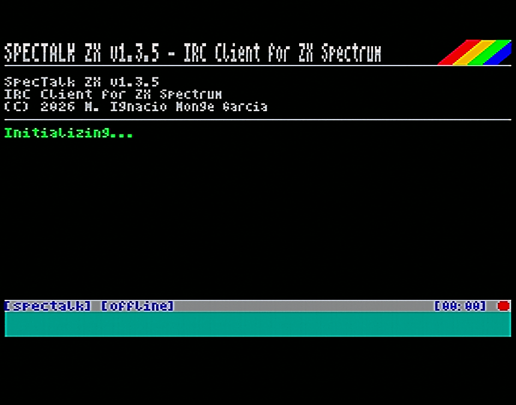
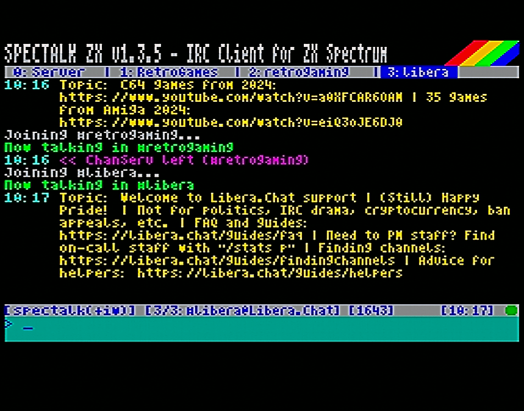
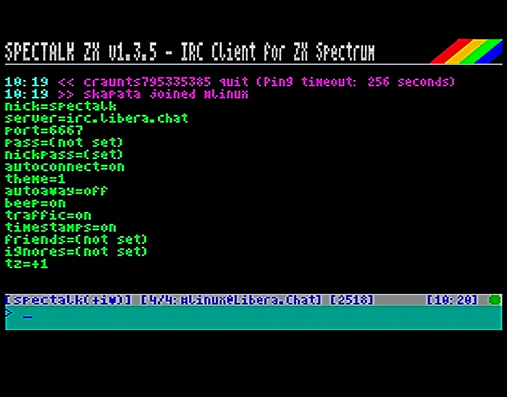

<p align="center">
  <a href="images/white_banner.png"></a>
</p>

# SpecTalk ZX

**IRC Client for ZX Spectrum with ESP8266 WiFi**

🇪🇸 [Leer en español](READMEsp.md)


---

## Overview

SpecTalk ZX is a fully-featured IRC client for the ZX Spectrum, bringing modern chat functionality to classic 8-bit hardware. Using an ESP8266 WiFi module for connectivity, it provides a complete IRC experience with a custom 64-column display and support for up to 10 simultaneous channel and private message windows.

---

## Features

### Display & Interface
- **64-column display** with custom 4-pixel wide font for maximum text density
- **Multi-window interface** supporting up to 10 simultaneous channels/queries
- **3 color themes** with unique badge designs: Default (rainbow dither), Terminal (blinking `<<<`), Commander (`_ [] X`)
- **Double-height banner** with BRIGHT split effect (NetManZX style)
- **Activity indicators**: Visual markers for windows with unread messages, blinking badge on Theme 2
- **Mention highlighting**: Windows with nick mentions displayed in highlight color
- **Channel switcher bar**: Press EDIT for a visual tab overlay with live unread/mention indicators
- **Connection indicator**: Three-state LED (🔴 No WiFi → 🟡 WiFi OK → 🟢 Connected)
- **Real-time clock** synchronized via SNTP
- **Optional timestamps** on all messages

### IRC Protocol
- **Full IRC compliance**: JOIN, PART, QUIT, NICK, PRIVMSG, NOTICE, TOPIC, MODE, KICK, WHO, WHOIS, LIST, NAMES
- **CTCP support**: VERSION, PING, TIME, ACTION
- **NickServ integration**: Quick identification with `/id` command or automatic with `nickpass=`
- **Away system**: Manual `/away` and automatic `/autoaway` with idle timer
- **User ignore**: Block messages from specific users with `/ignore`
- **Channel search**: Find channels or users by pattern
- **UTF-8 support**: International characters converted to readable ASCII

### Connectivity
- **Auto-connect**: Connect automatically to configured server on startup
- **Auto-identify**: Automatic NickServ identification after connect
- **Friends system**: Monitor up to 5 friends' online status with notifications
- **Nick collision handling**: Automatic alternate nick if primary is in use
- **Keep-alive system**: Automatic PING to detect silent disconnections
- **Ping latency**: Server response time measurement

### Performance & Low-Level
- **IM2 interrupt mode**: Custom interrupt handler prevents divMMC conflicts, enables system RAM hijacking
- **System RAM hijacking**: Printer Buffer, CHANS workspace and UDG area repurposed for variables (+602 bytes BSS freed)
- **14 custom peephole rules**: Subroutine factoring across 200+ call sites (-1,520 bytes code)
- **Unity Build Architecture**: Entire client compiled as single unit for maximum optimization
- **Ring Buffer**: 2KB buffer for reliable high-speed data reception
- **Assembly-optimized**: Critical rendering paths written in Z80 assembly, inline space rendering
- **Dual UART drivers**: Hardware UART (115200 baud) and AY bit-bang (9600 baud)
- **esxDOS detection**: Safe divMMC detection at startup; works without SD card using defaults

A live IRC session on Libera Chat, showing the 64-column display and multi-user conversation:

<p align="center">
  <a href="images/snap1.png"></a>
</p>

The boot sequence screen, displaying hardware detection and initialization progress:

<p align="center">
  <a href="images/boot.png"></a>
</p>

---

## Hardware Requirements

| Component | Specification |
|-----------|---------------|
| **Computer** | ZX Spectrum 48K, 128K, +2, +2A, +3, or compatible |
| **WiFi Module** | ESP8266 (ESP-01 or similar) with AT firmware |
| **Interface** | divMMC, divTIESUS, or AY-based UART adapter |

### Baud Rate Configuration

| Interface | Driver | Baud Rate |
|-----------|--------|-----------|
| divMMC / divTIESUS | Hardware UART | **115200** bps |
| ZX-Uno / AY Interface | AY-3-8912 Bit-bang | **9600** bps |

> ⚠️ **Important**: Configure your ESP8266 to match the baud rate for your interface before use.

---

## Installation

1. Download the release ZIP for your hardware (includes TAP + data file):
   - `spectalk_divmmc.zip` for divMMC/divTIESUS (115200 baud)
   - `spectalk_ay.zip` for AY interface (9600 baud)
2. Extract and copy both files to your SD card:
   - `SpecTalkZX.tap` — the program
   - `SPECTALK.DAT` — font, themes and help data (must be in the same directory as the TAP)
3. Load on your Spectrum via SD card, tape, or other method
4. Configure WiFi credentials using [NetManZX](https://github.com/IgnacioMonge/NetManZX) or similar tool

> **Important**: `SPECTALK.DAT` is required. Without it the 64-column font and help screens will not load.

---

## Quick Start

1. **Initialize**: On startup, wait for `WiFi:OK` in the status bar (indicator turns yellow, then green when connected)

2. **Set nickname**:
   ```
   /nick YourNickname
   ```

3. **Connect to server**:
   ```
   /server irc.libera.chat 6667
   ```

4. **Join a channel**:
   ```
   /join #spectrum
   ```

5. **Start chatting!** Type your message and press ENTER

The three built-in color themes, each with a unique badge design:

<p align="center">
  <a href="images/theme1.png"></a>
  &nbsp;&nbsp;
  <a href="images/theme2.png"></a>
  &nbsp;&nbsp;
  <a href="images/theme3.png"></a>
  <br>
  <em>Default &nbsp;&nbsp;&nbsp;&nbsp;&nbsp;&nbsp;&nbsp;&nbsp;&nbsp;&nbsp;&nbsp;&nbsp;&nbsp;&nbsp;&nbsp;&nbsp;&nbsp;&nbsp;&nbsp;&nbsp;&nbsp;&nbsp;&nbsp;&nbsp;&nbsp; Terminal &nbsp;&nbsp;&nbsp;&nbsp;&nbsp;&nbsp;&nbsp;&nbsp;&nbsp;&nbsp;&nbsp;&nbsp;&nbsp;&nbsp;&nbsp;&nbsp;&nbsp;&nbsp;&nbsp;&nbsp;&nbsp;&nbsp;&nbsp;&nbsp;&nbsp; Commander</em>
</p>

---

## Command Reference

### Keyboard Controls

| Key | Action |
|-----|--------|
| **ENTER** | Send message or execute command |
| **EDIT** (Caps+1) | Open/close channel switcher bar |
| **DELETE** (Caps+0) | Delete character (backspace) |
| **← / →** | Move cursor within input line |
| **↑ / ↓** | Navigate command history |
| **BREAK** (Caps+Space) | Exit help screens |

### System Commands (!)

Local commands that don't require server connection.

| Command | Alias | Description |
|---------|-------|-------------|
| `!help` | `!h` | Display help screens |
| `!status` | `!s` | Show connection status and statistics |
| `!init` | `!i` | Reinitialize ESP8266 module |
| `!config` | `!cfg` | Show current configuration values |
| `!theme N` | — | Change color theme (1, 2, or 3) |
| `!about` | — | Show version and credits |

### IRC Commands (/)

#### Connection

| Command | Alias | Description |
|---------|-------|-------------|
| `/server host [port]` | `/connect` | Connect to IRC server (default port: 6667) |
| `/nick [name]` | — | View current or set new nickname |
| `/pass [password]` | — | View, set or clear (`none`) server password |
| `/id [password]` | — | Identify with NickServ (uses saved password if none given) |
| `/quit [message]` | — | Disconnect from server with optional message |

#### Channels

| Command | Alias | Description |
|---------|-------|-------------|
| `/join #channel` | `/j` | Join a channel |
| `/part [message]` | `/p` | Leave current channel |
| `/topic [text]` | — | View or set channel topic |
| `/names` | — | List users in current channel |
| `/kick nick [reason]` | `/k` | Kick user from channel (ops only) |

#### Messages

| Command | Alias | Description |
|---------|-------|-------------|
| `/msg nick text` | `/m` | Send private message |
| `/query nick` | `/q` | Open private message window |
| `/me action` | — | Send action (appears as *YourNick action*) |
| `nick: text` | — | Shortcut: send PM to nick (without /msg) |

#### Windows

| Command | Alias | Description |
|---------|-------|-------------|
| `/0` ... `/9` | — | Switch to window by number (0 = server) |
| `/channels` | `/w` | List all open windows (mentions highlighted) |
| `/close` | — | Close current window |

#### Tools

| Command | Alias | Description |
|---------|-------|-------------|
| `/search pattern` | — | Search channels (`#pattern`) or users (`pattern`) |
| `/list pattern` | `/ls` | List channels matching pattern (full list disabled) |
| `/who pattern` | — | Search users matching pattern |
| `/whois nick` | `/wi` | Get information about a user |
| `/ignore [nick]` | — | Toggle ignore for nick (`-nick` to remove), or list ignored |
| `/raw command` | — | Send raw IRC command to server |

#### Away Status

| Command | Alias | Description |
|---------|-------|-------------|
| `/away [message]` | — | Set away status with message, or clear if no message |
| `/autoaway N` | `/aa` | Set auto-away after N minutes idle (1-60, 0=off) |

> **Auto-away behavior**: When enabled, automatically sets you away after N minutes of inactivity. Sending any message clears auto-away automatically. Manual `/away` must be cleared manually with `/away`.

#### Preferences

| Command | Alias | Description |
|---------|-------|-------------|
| `/beep` | — | Toggle sound on nick mention (on/off) |
| `/traffic` | — | Toggle display of QUIT/JOIN messages (on/off) |
| `/timestamps` | `/ts` | Cycle timestamp mode (off/on/smart) |
| `/autoconnect` | `/ac` | Toggle auto-connect on startup (on/off) |
| `/tz [±N]` | — | View or set timezone offset (UTC -12 to +12) |
| `/friend [nick]` | — | List friends, or toggle add/remove a friend (max 5) |
| `/clear` | `/cls` | Clear the chat area |
| `/save` | `/sv` | Save current configuration to SD card |

---

## Window Management

SpecTalk supports up to 10 simultaneous windows:

- **Window 0**: Server messages (always present)
- **Windows 1-9**: Channels and private queries

### Navigation
- Use `/0` through `/9` to switch windows
- Use `/w` or `/channels` to see all open windows
- Press **EDIT** to open the **channel switcher bar** — a visual tab overlay showing all active channels. Use LEFT/RIGHT to navigate, ENTER to select, or digit keys for direct access. Auto-hides after 20 seconds.
- Activity indicator (●) shows windows with unread messages
- Mention indicator (!) shows windows where your nick was mentioned (highlighted in color)

The channel switcher bar in action, showing active channels with unread indicators:

<p align="center">
  <a href="images/switcher.png"></a>
</p>

### Private Messages
- Incoming PMs automatically create a query window
- Use `/query nick` to manually open a private chat
- Use `/close` to close the current query window

---

## Configuration File

SpecTalk can load settings from a configuration file on your SD card. The file should be named `SPECTALK.CFG` and placed in the `SYS/CONFIG/` directory. Use `/save` to write your current settings to this file.

### File Format

Plain text file with one setting per line in `key=value` format:

```
nick=MyNickname
server=irc.libera.chat
port=6667
nickpass=mynickservpassword
autoconnect=1
theme=1
timestamps=1
autoaway=15
beep=1
traffic=1
tz=1
friends=Friend1,Friend2,Friend3
ignores=Troll1,Troll2
```

### Available Settings

| Setting | Description | Values | Default |
|---------|-------------|--------|---------|
| `nick` | Default nickname | Any valid IRC nick | (none) |
| `server` | IRC server hostname | Hostname or IP | (none) |
| `port` | Server port | 1-65535 | 6667 |
| `pass` | Server password | Any string | (none) |
| `nickpass` | NickServ password | Any string | (none) |
| `autoconnect` | Connect on startup | 0 or 1 | 0 |
| `theme` | Color theme | 1, 2, or 3 | 1 |
| `timestamps` | Show timestamps | 0, 1, or 2 (smart) | 1 |
| `autoaway` | Auto-away minutes | 0-60 (0=off) | 0 |
| `beep` | Sound on mention | 0 or 1 | 1 |
| `traffic` | Show quit/join messages | 0 or 1 | 1 |
| `tz` | Timezone offset | -12 to +12 | 1 |
| `friends` | Friend nicks to monitor (comma-separated, max 5) | nick1,nick2,... | (none) |
| `ignores` | Ignored nicks (comma-separated, max 5) | nick1,nick2,... | (none) |

### Viewing Current Configuration

Use `!config` or `!cfg` to display all current configuration values. Use `/save` to persist changes to the SD card.

The configuration display showing all current settings at a glance:

<p align="center">
  <a href="images/config.png"></a>
</p>

---

## Status Bar

The status bar displays connection state, channel info, and clock in the following format:

```
[nick(+modes)] [idx/total:channel(@network)(+chanmodes)] [users]    [HH:MM] [LED]
```

| Element | Description |
|---------|-------------|
| **nick(+modes)** | Your current nickname and user modes (if any) |
| **idx/total:channel** | Window index, total windows, and current channel name |
| **@network** | Network name (if available) |
| **+chanmodes** | Channel modes (if any) |
| **users** | Number of users in the current channel |
| **HH:MM** | Current time (SNTP synchronized), displayed at the right |
| **LED** | Connection indicator at far right: 🔴 No WiFi, 🟡 WiFi OK, 🟢 Connected |

When away, the indicator changes from a solid circle to a half-circle.

---

## Building from Source

### Requirements
- **z88dk** with SDCC support
- **GNU Make**

### Build Commands

```bash
# Standard build (divMMC/divTIESUS - 115200 baud)
make

# AY interface build (9600 baud)
make ay

# Clean build artifacts
make clean
```

The project uses **Unity Build** strategy: all C sources are compiled as a single unit (`main_build.c`) enabling aggressive cross-function optimization.

---

## Troubleshooting

| Problem | Solution |
|---------|----------|
| Indicator stays red | Check ESP8266 wiring and baud rate configuration |
| Indicator yellow but won't connect | Verify WiFi credentials with NetManZX |
| "Connection timeout" after idle | Normal behavior - keep-alive detected dead connection |
| Messages from user won't stop | Use `/ignore nick` to block them |
| Can't identify with NickServ | Use `/id password` or set `nickpass=` in config file |
| Forgot current settings | Use `!config` to view all configuration values |
| Too many quit messages | Use `/traffic` to toggle them off |
| No sound on mentions | Use `/beep` to toggle sound on |
| Nick in use on connect | SpecTalk auto-adds `_` - use `/nick` to change after |
| Accented characters look wrong | UTF-8 is auto-converted to ASCII equivalents |

---

## License

SpecTalk ZX is free software released under the **GNU General Public License v2.0**.

Includes code derived from:
- **BitchZX** — IRC client (GPLv2)
- **AY/ZXuno UART driver** by Nihirash

---

## Author

**M. Ignacio Monge García** — 2025-2026

---

## Acknowledgments

- BitchZX project for IRC protocol foundation
- Nihirash for AY UART driver code
- z88dk team for the cross-compiler toolchain
- ZX Spectrum retro computing community

---

*Connecting the ZX Spectrum to IRC since 2025*
