# SpecTalkZX

<p align="center">
  
</p>

<p align="center"><strong>IRC client for ZX Spectrum, Spectrum Next and the Spectranext cartridge</strong></p>

<p align="center">🇪🇸 <a href="READMEsp.md">Leer en español</a></p>

<p align="center">
  <strong>Installation:</strong>
  <a href="#classic-zx--divmmc">Classic ZX / divMMC</a> ·
  <a href="#native-spectrum-next">Native Spectrum Next</a> ·
  <a href="#spectranext-cartridge">Spectranext cartridge</a>
</p>

<p align="center">
  
  
  
</p>

Current release:
[SpecTalkZX 1.4.0 Proteus](https://github.com/IgnacioMonge/SpecTalkZX/releases/tag/v1.4.0).

Version 1.4.0 adds native Spectrum Next support and a new paging system for the
Spectranext cartridge. The Classic ZX/divMMC edition keeps the same interface,
commands and configuration format.

---

## Contents

- [Highlights in 1.4.0](#highlights-in-140)
- [Requirements](#requirements)
- [Installation](#installation)
- [Quick Start](#quick-start)
- [Screenshots](#screenshots)
- [Interface](#interface)
- [Keyboard Controls](#keyboard-controls)
- [IRC Behaviour](#irc-behaviour)
- [Commands](#commands)
- [Configuration](#configuration)
- [Spectranext limits](#spectranext-limits)
- [Build](#build)
- [Troubleshooting](#troubleshooting)
- [License](#license)
- [Author](#author)

---

## Highlights in 1.4.0

- **Native Spectrum Next support**, with the same SpecTalkZX interface and IRC
  commands.
- **New Spectranext paging system**, keeping incoming IRC data separate from
  secondary screens and commands.
- **More resilient startup on native Next**, including recovery from an
  unresponsive ESP and BREAK cancellation.

See [CHANGELOG.md](CHANGELOG.md) for the complete user-visible change history
and compatibility notes.

---

## Requirements

| Target | Computer | Storage | Network |
|---|---|---|---|
| Classic | ZX Spectrum 48K, 128K, +2, +2A, +3 or compatible | divMMC/esxDOS SD storage | Supported 115200-baud UART with ESP8266 or compatible ESP-AT bridge |
| Native Next | ZX Spectrum Next with NextZXOS/esxDOS | SD card for the NEX and writable `/SYS/CONFIG` or `/SYS` | Configured internal ESP |
| Spectranext | ZX Spectrum model supported by the Spectranext cartridge firmware | Local cartridge XFS | Native cartridge Wi-Fi and ROM sockets |

Classic uses <code>SpecTalkZX.tap</code>, <code>SPECTALK.OVL</code> and
<code>SPECTALK.DAT</code>. Keep all three files from the same release.
Spectranext installs its own matching TAP, OVL and DAT files in cartridge
storage. Native Next uses one self-contained <code>SPECTALK.NEX</code>.

---

## Installation

### Classic ZX / divMMC

1. Download `spectalk_divmmc_v1.4.0.zip` from the
   [1.4.0 release](https://github.com/IgnacioMonge/SpecTalkZX/releases/tag/v1.4.0).
2. Copy <code>SpecTalkZX.tap</code>, <code>SPECTALK.OVL</code> and
   <code>SPECTALK.DAT</code> into the same directory on the SD card.
3. Configure the ESP-AT bridge for **115200 baud**. Wi-Fi credentials can be
   prepared with [NetManZX](https://github.com/IgnacioMonge/NetManZX) or an
   equivalent ESP-AT setup tool.
4. Load <code>SpecTalkZX.tap</code>, wait for the network indicator and connect
   to IRC.

### Native Spectrum Next

1. Download `spectalk_next_v1.4.0.zip` from the
   [1.4.0 release](https://github.com/IgnacioMonge/SpecTalkZX/releases/tag/v1.4.0).
2. Configure the Spectrum Next internal ESP for the desired Wi-Fi network.
3. Copy <code>SPECTALK.NEX</code> to the Next SD card.
4. Launch it from the NextZXOS browser. Configuration and bookmarks are written
   under <code>/SYS/CONFIG</code>, with <code>/SYS</code> as a fallback.

### Spectranext cartridge

The public installer provides SpecTalkZX 1.4.0 and requires Spectranext firmware
`0.9-6fc153a3` or later.

1. Connect the cartridge to Wi-Fi.
2. In the Spectranext menu, select **Load Resource URL** and enter:
   <code>https://ignaciomonge.github.io/SpecTalkZX/</code>.
3. The guided installer validates the package, writes
   <code>SPECTALK.tap</code>, <code>SPECTALK.OVL</code>,
   <code>SPECTALK.DAT</code> and <code>SPECTALK.ZX</code> to local XFS, then
   launches the client.
4. Afterwards start <code>SPECTALK.ZX</code> from local XFS. To update, use
   **Load Resource URL** again;
   <code>/CFG/SPECTALK.CFG</code> and the five bookmark files are preserved.

---

## Quick Start

```text
/nick YourNick
/server irc.libera.chat 6667
/join #spectrum
```

Useful first setup:

```text
!theme 1
!timestamps smart
!notif on
!nickcolor on
!save
```

To save a complete session, open `!bm`. In bookmarks: **UP/DOWN** selects a slot, **S** stores the current server/channel snapshot, **A** marks it for startup, **ENTER** connects, **D** deletes, and **BREAK** saves/exits.

---

## Screenshots

The gallery combines 1.4.0 captures from native Spectrum Next, Spectranext and
Classic.

### Getting started and navigation

<table>
  <tr>
    <td align="center" valign="top" width="50%">
      <strong>Guided installer</strong><br>
      <a href="images/snapshot-spectranext-installer.png">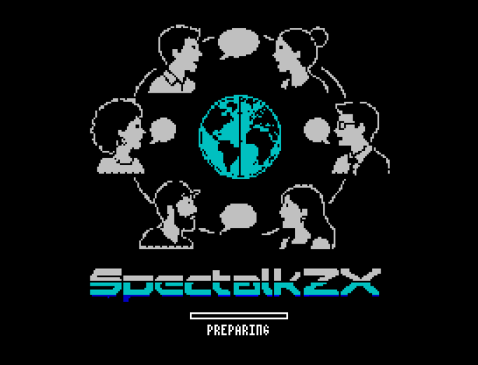</a><br>
      <sub>The Spectranext installer writes the client to local XFS while preserving configuration and bookmarks.</sub>
    </td>
    <td align="center" valign="top" width="50%">
      <strong>Choose your nick</strong><br>
      <a href="images/snapshot-nick.png">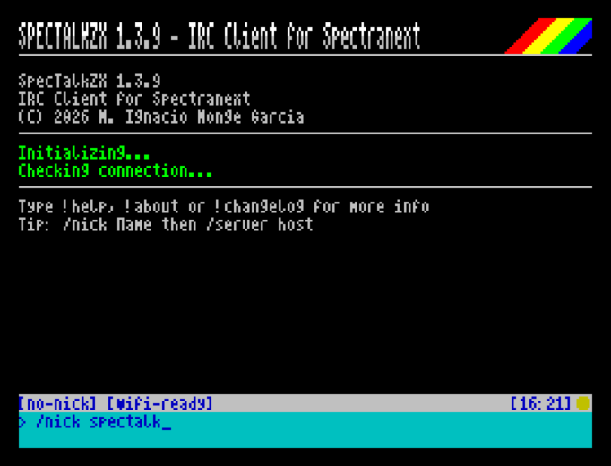</a><br>
      <sub>First-run nick selection before opening a server connection.</sub>
    </td>
  </tr>
  <tr>
    <td align="center" valign="top" width="50%">
      <strong>Connected server</strong><br>
      <a href="images/snapshot-connected.png">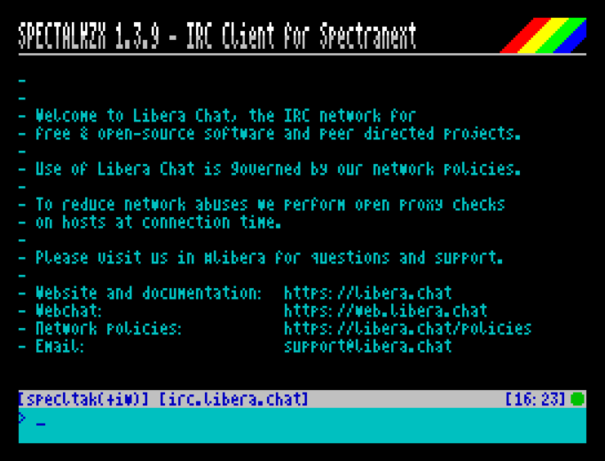</a><br>
      <sub>The server window after Spectranext connects to IRC.</sub>
    </td>
    <td align="center" valign="top" width="50%">
      <strong>Window navigation</strong><br>
      <a href="images/snapshot-options.png">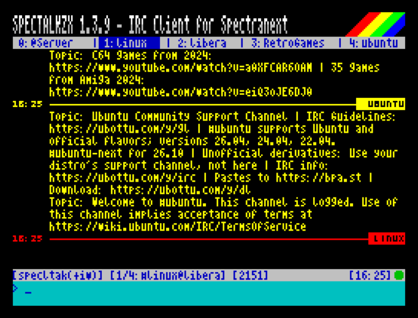</a><br>
      <sub>The tab bar keeps the server and active channel contexts one key away.</sub>
    </td>
  </tr>
</table>

### Conversation and discovery

<table>
  <tr>
    <td align="center" valign="top" width="33%">
      <strong>Joining a channel</strong><br>
      <a href="images/snapshot-joining.png">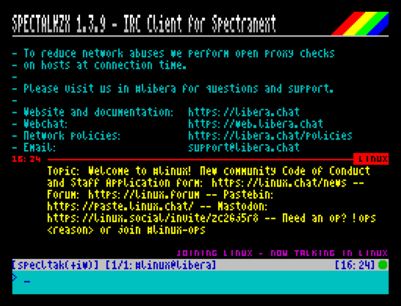</a><br>
      <sub>Join progress and channel context remain visible during registration.</sub>
    </td>
    <td align="center" valign="top" width="33%">
      <strong>Live conversation</strong><br>
      <a href="images/snapshot-chat.png">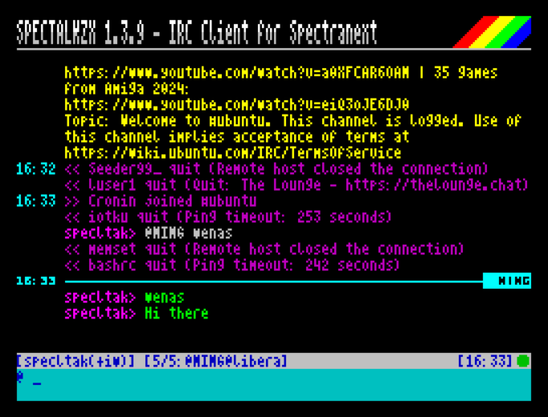</a><br>
      <sub>Native Spectrum Next chat with timestamps, nick colours, modes and unread state.</sub>
    </td>
    <td align="center" valign="top" width="33%">
      <strong>Fast private reply</strong><br>
      <a href="images/snapshot-fast-reply.png">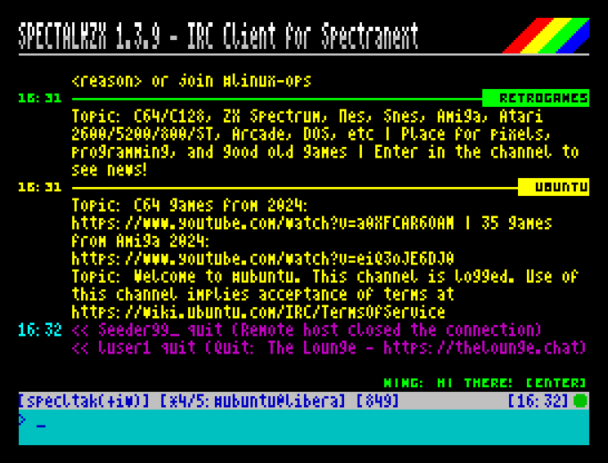</a><br>
      <sub>Press ENTER on a private-message notification to open the conversation.</sub>
    </td>
  </tr>
  <tr>
    <td align="center" valign="top" width="33%">
      <strong>Friends online</strong><br>
      <a href="images/snapshot-friends-online.png">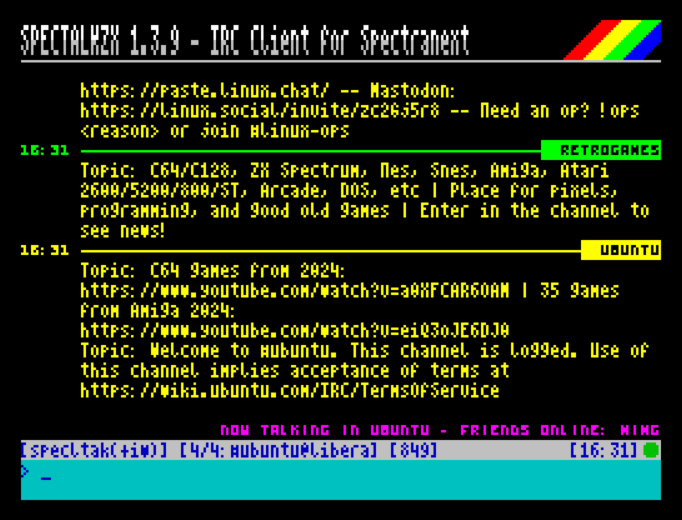</a><br>
      <sub>Friends found during NAMES are collected into one compact notification.</sub>
    </td>
    <td align="center" valign="top" width="33%">
      <strong>Channel users</strong><br>
      <a href="images/snapshot-users.png">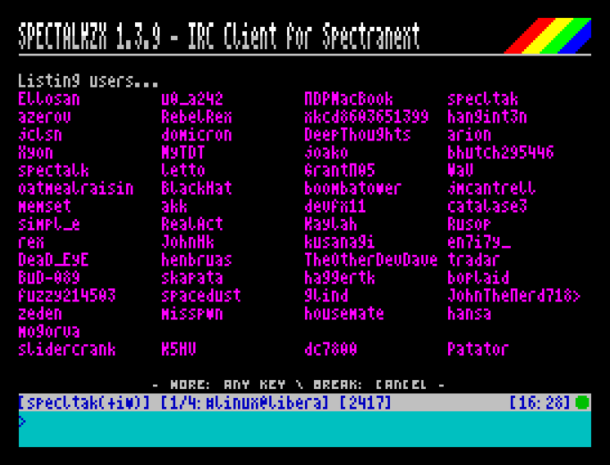</a><br>
      <sub>The paginated four-column /names view keeps long nick lists readable.</sub>
    </td>
    <td align="center" valign="top" width="33%">
      <strong>Channel search</strong><br>
      <a href="images/snapshot-channel-search.png">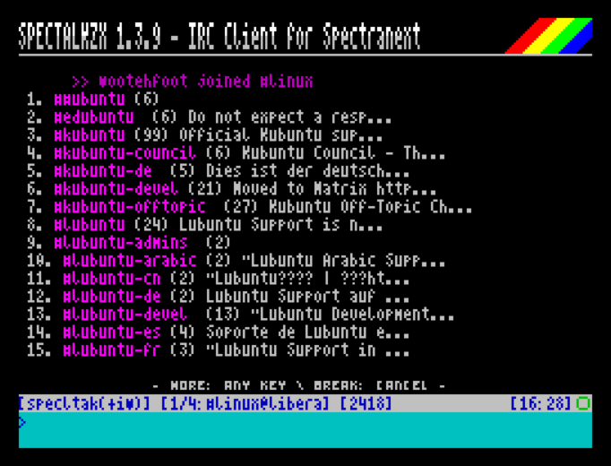</a><br>
      <sub>Search and paging present large channel lists without colliding with input.</sub>
    </td>
  </tr>
</table>

### Management and information

<table>
  <tr>
    <td align="center" valign="top" width="33%">
      <strong>Bookmarks</strong><br>
      <a href="images/snapshot-bookmarks.png">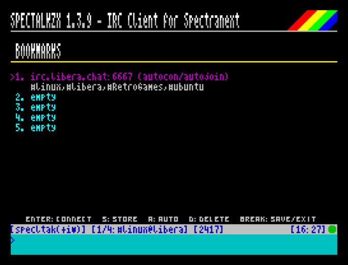</a><br>
      <sub>Five independent slots store server, port, channels and startup policy.</sub>
    </td>
    <td align="center" valign="top" width="33%">
      <strong>Configuration</strong><br>
      <a href="images/snapshot-config.png">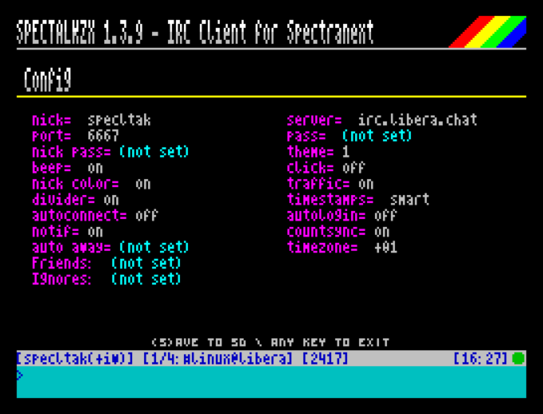</a><br>
      <sub>The complete active configuration is inspectable without leaving the client.</sub>
    </td>
    <td align="center" valign="top" width="33%">
      <strong>Connection status</strong><br>
      <a href="images/snapshot-status.png">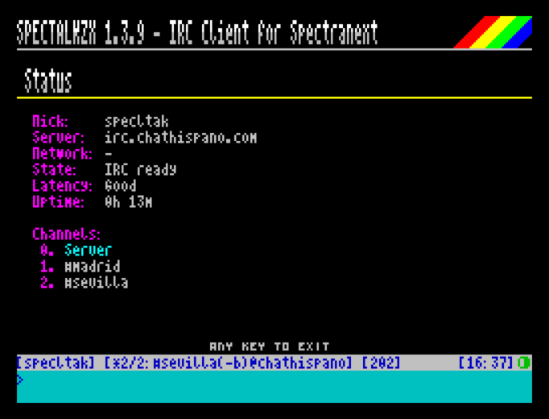</a><br>
      <sub>Network state, latency, uptime and open windows are summarized together.</sub>
    </td>
  </tr>
  <tr>
    <td align="center" valign="top" width="33%">
      <strong>Command help</strong><br>
      <a href="images/snapshot-help.png">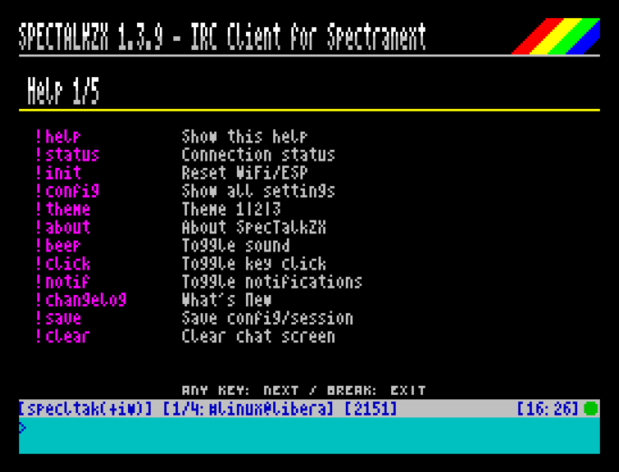</a><br>
      <sub>Built-in help covers local and IRC commands without leaving the client.</sub>
    </td>
    <td align="center" valign="top" width="33%">
      <strong>About</strong><br>
      <a href="images/snapshot-about.png">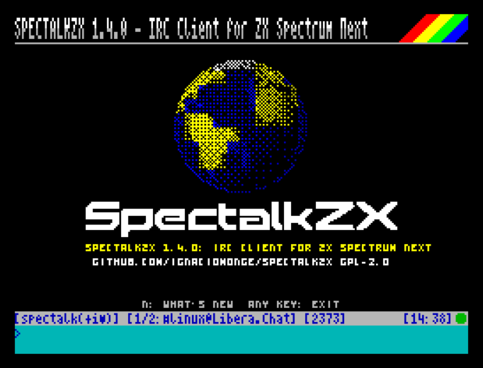</a><br>
      <sub>The animated Earth and native Spectrum Next banner shown during a live connection.</sub>
    </td>
    <td align="center" valign="top" width="33%">
      <strong>What's New</strong><br>
      <a href="images/snapshot-changes.png">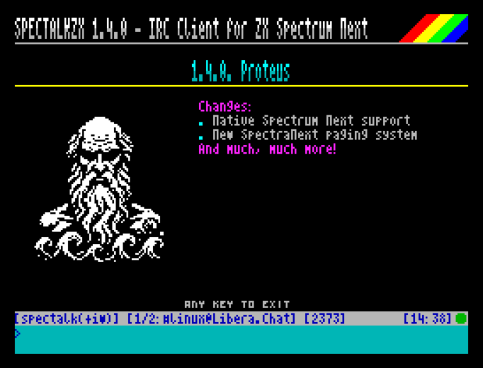</a><br>
      <sub>The 1.4.0 Proteus screen presents the native Next edition and new Spectranext paging system.</sub>
    </td>
  </tr>
</table>

### Themes

<table>
  <tr>
    <td align="center" valign="top" width="33%">
      <strong>Theme 1</strong><br>
      <a href="images/snapshot-theme-1-away.png">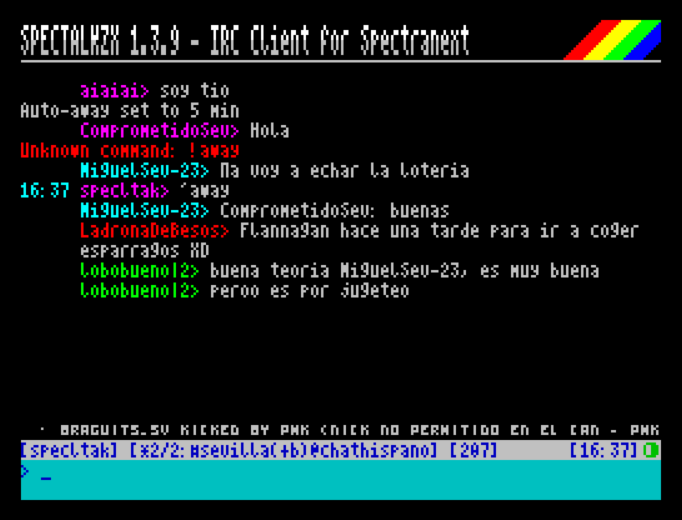</a><br>
      <sub>Default palette showing away state, notifications and coloured nicks.</sub>
    </td>
    <td align="center" valign="top" width="33%">
      <strong>Theme 2</strong><br>
      <a href="images/snapshot-theme-2.png">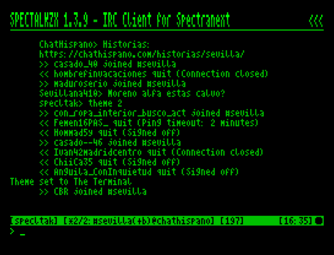</a><br>
      <sub>Green terminal-style palette with the same full IRC interface.</sub>
    </td>
    <td align="center" valign="top" width="33%">
      <strong>Theme 3</strong><br>
      <a href="images/snapshot-theme-3.png">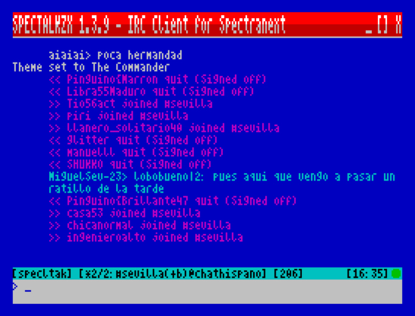</a><br>
      <sub>High-contrast blue/red palette.</sub>
    </td>
  </tr>
</table>

---

## Interface

- **64-column chat display** with a custom 4-pixel font.
- **Up to 10 windows**: server window `0` plus channel or private-chat windows `1` to `9`.
- **Direct window switching** with `!0` through `!9` or `/0` through `/9`.
- **EDIT selector** with unread/mention markers and direct numeric selection.
- **Three themes** with distinct status indicators and colour behaviour.
- **Per-nick colours** with `!nickcolor`.
- **Smart notifications** using the Ikkle-4 mini-font at the bottom row.
- **PM quick reply**: ENTER on a PM notification opens a private chat with the sender.
- **Optional timestamps**: off, on, or smart.
- **Channel context dividers** with `!divider`.
- **Status bar** with nick, current window, network/modes, user count, clock, away marker, and three-state connection indicator.


## Keyboard Controls

| Key | Action |
|-----|--------|
| **ENTER** | Send message, run command, or accept an action |
| **EDIT** | Open or close the channel selector |
| **DELETE** | Delete character behind cursor |
| **LEFT/RIGHT** | Move cursor or selection |
| **UP/DOWN** | Command history or row selection |
| **Symbol Shift + LEFT/RIGHT** | Word-by-word cursor movement |
| **Symbol Shift + DELETE** | Delete previous word |
| **BREAK** | Dismiss notification, cancel paging, or leave a secondary screen |
| **ENTER on PM notification** | Open a private chat with the sender |

---


## IRC Behaviour

- Supports the usual IRC workflow: `JOIN`, `PART`, `QUIT`, `NICK`, `PRIVMSG`, `NOTICE`, `TOPIC`, `MODE`, `KICK`, `WHO`, `WHOIS`, `LIST`, and `NAMES`.
- Supports CTCP `VERSION`, `PING`, `TIME`, and `ACTION`.
- NickServ can be used manually with `/id` or automatically with `nickpass=`.
- `nickserv=` can override the service nick when a network does not use standard `NickServ` naming.
- Friends are monitored through `!friend`; JOIN/NAMES results generate compact notifications.
- Ignores are managed with `/ignore`, including `-nick` removal.
- Away state supports manual `/away` and idle `!autoaway`.
- Connection checks detect silent disconnects and remain active during About.
- Long sessions keep channel user counts more stable through NAMES handling and optional `!countsync`.

---
## Commands

### Local Commands

| Command | Alias | Description |
|---------|-------|-------------|
| `!help` | `!h` | Show command help |
| `!status` | `!s` | Show connection, latency, uptime, and window status |
| `!init` | `!i` | Restart the network connection |
| `!config` | `!cfg` | Show all current settings |
| `!theme N` | | Switch theme `1`, `2`, or `3` |
| `!about` | | Animated About screen |
| `!changelog` | | What's New screen |
| `!bookmarks` | `!bm` | Open the IRC bookmark manager |
| `!save` | `!sv` | Save config and current session |
| `!autoconnect` | `!ac` | Toggle startup server connection |
| `!autojoin` | | Toggle replay of saved channels after registration |
| `!tz` | | Show/set timezone `-12`..`+12`; `rtc` uses a supported local RTC |
| `!timestamps` | `!ts` | Cycle off/on/smart timestamp modes |
| `!notif` | `!nf` | Toggle notifications |
| `!beep` | | Toggle mention sound |
| `!click` | | Toggle key click |
| `!traffic` | | Toggle JOIN/PART/QUIT presence noise |
| `!divider` | | Toggle channel context separators |
| `!countsync` | `!cs` | Toggle idle user-count resync |
| `!autoaway` | `!aa` | Auto-away after N minutes, `0` disables |
| `!friend` | | List or toggle tracked friends |
| `!nickcolor` | `!nc` | Toggle per-nick colours |
| `!clear` | `!cls` | Clear chat area |

Toggle commands with no argument alternate their state; they accept `on`/`off`/`1`/`0`.
`!timestamps` also accepts `smart`.

### IRC Commands

| Command | Alias | Description |
|---------|-------|-------------|
| `/server [host [port]\|host:port]` | `/connect` | No args: show state or reconnect saved server; otherwise connect to the given host |
| `/nick [name]` | | View or set nick |
| `/pass [password\|clear\|none]` | | View/set stored password; `clear`/`none` remove it for the next connection |
| `/id [password]` | | Identify with NickServ or detected service nick |
| `/join channel\|#channel\|&channel` | `/j` | Join a bare, `#`- or `&`-prefixed channel |
| `/part [#channel\|&channel] [message]` | `/p` | Leave the current or named `#`/`&` channel |
| `/msg nick text` | `/m` | Send private message |
| `/reply text` | | Reply to the last PM sender |
| `/notice target text` | | Send IRC NOTICE |
| `/query nick` | `/q` | Open a private query window |
| `/close` | | Close current query or part current channel |
| `/quit [message]` | | Disconnect, with confirmation guard |
| `/me action` | | Send CTCP ACTION |
| `/away [message]` | | Set or clear away |
| `/raw command` | | Send raw IRC command |
| `/whois nick` | `/wi` | Show WHOIS information |
| `/who [channel\|nick]` | | Search users; defaults to the current channel |
| `/list pattern` | `/ls` | List channels |
| `/names [#channel\|&channel]` | | Paginated grid of users in the current or named channel |
| `/topic [#channel] [text]` | | View/set topic; target and text are optional |
| `/mode [args]` | | View/set channel or target modes |
| `/search #pattern\|nick` | | Search LIST channels with `#pattern` or WHO users with `nick` |
| `/ignore [nick]` | | List, add, or remove ignored nicks (`-nick`) |
| `/kick nick [reason]` | `/k` | Kick from current channel |
| `/channels` | `/w` | List open windows |
| `/0`..`/9` | | Switch to a numbered window |

`/pass` only updates the stored password used when opening the next connection; it
does not send an immediate IRC `PASS` command. The numeric `!0`..`!9` and
`/0`..`/9` forms select numbered windows directly.

---

## Configuration

SpecTalkZX writes the current configuration with `!save`. Classic and native
Next load `SPECTALK.CFG` from `/SYS/CONFIG/`, with `/SYS/` as a fallback.
Spectranext loads `/CFG/SPECTALK.CFG` from local cartridge XFS.

```ini
nick=MyNick
server=irc.libera.chat
port=6667
pass=
nickpass=myNickServPassword
nickserv=NickServ
autoconnect=1
autojoin=1
channels=#spectrum,#zx
theme=1
timestamps=2
autoaway=15
beep=1
click=1
traffic=1
divider=1
countsync=1
tz=1
notif=1
nickcolor=1
friends=Friend1,Friend2
ignores=NoisyNick
```


Supported settings:

| Setting | Values | Notes |
|---------|--------|-------|
| `nick` | IRC nick | Default nick |
| `server` | Hostname/IP | IRC server |
| `port` | Decimal port | Default IRC port is `6667` |
| `pass` | Text or empty | Server password |
| `nickpass` | Text or empty | NickServ password for `/id` / auto-identify |
| `nickserv` | Nick or empty | Service nick override, for non-standard networks |
| `autoconnect` | `0`/`1` | Connect to saved server at startup |
| `autojoin` | `0`/`1` | Join saved `channels` after IRC registration |
| `channels` | Comma-separated channels | Session restore channel list |
| `theme` | `1`, `2`, `3` | Colour theme |
| `timestamps` | `0`, `1`, `2` | Off, on, smart |
| `beep` | `0`/`1` | Mention sound |
| `click` | `0`/`1` | Key click sound |
| `traffic` | `0`/`1` | JOIN/PART/QUIT traffic display |
| `divider` | `0`/`1` | Channel context separators |
| `countsync` | `0`/`1` | Idle user-count resync |
| `notif` | `0`/`1` | Bottom-row notifications |
| `nickcolor` | `0`/`1` | Per-nick colours |
| `autoaway` | `0`-`60` | Idle minutes, `0` disables |
| `tz` | `-12`..`+12` or `rtc` | Numeric SNTP offset or a local RTC where supported |
| `tzlast` | `-12`..`+12` | Last numeric timezone used when leaving RTC mode |
| `friends` | Comma-separated nicks | Up to five tracked friends |
| `ignores` | Comma-separated nicks | Up to five ignored nicks |

Notable settings:

- `autoconnect=1` connects to the saved server on startup.
- `autojoin=1` replays the saved `channels=` list after IRC registration and after any required NickServ grace period.
- On Classic and native Next, `tz=rtc` uses a detected local RTC. Spectranext
  has no Z80-visible RTC: it uses UDP/SNTP and falls back from `rtc` to
  `tzlast`.
- `divider=0` hides future channel context separators.
- `countsync=0` disables idle count refresh after long sessions.
- `friends=` and `ignores=` hold up to five nicks each.

Bookmark files use `/SYS/CONFIG/SPTBM1.CFG` through `SPTBM5.CFG` on Classic
and native Next, falling back to `/SYS/SPTBM1.CFG` through `SPTBM5.CFG` when
`/SYS/CONFIG` is absent. Spectranext uses `/CFG/SPTBM1.CFG` through
`SPTBM5.CFG`.

---

## Spectranext limits

- IRC uses plaintext on the configured server port. The cartridge exposes TLS
  only on its fixed port-443 service, so IRC TLS on port 6697 is unavailable.
- The cartridge exposes no RTC to Z80 software. Spectranext uses UDP/SNTP;
  `tz=rtc` falls back to the last numeric timezone stored in `tzlast`.
- SpecTalkZX uses one cartridge network connection at a time. Clock
  synchronization runs before the IRC connection opens.
- Configuration and bookmarks are saved in XFS. A power loss during a write can
  leave the file incomplete.

---

## Build

Requirements: z88dk with SDCC support, GNU Make, Python 3.8 or newer, and a
POSIX-compatible shell toolset. On Windows, w64devkit provides the required
Make and shell utilities.

```sh
# Classic ZX
make NO_COLOR=1

# Native Spectrum Next
make next NO_COLOR=1

# Release builds
make release NO_COLOR=1
make release NO_COLOR=1 PLATFORM=next
make release NO_COLOR=1 PLATFORM=spectranext SPXN_DIR=/path/to/Spectranext/driver
```

Build outputs:

- `build/SpecTalkZX.tap`
- `build/SPECTALK.OVL`
- `build/SPECTALK.DAT`
- `build/SPECTALK.NEX` from `make next` (self-contained native Next image)

The Spectranext target also needs the driver directory from the Spectranext SDK.

---

## Troubleshooting

| Problem | Check |
|---|---|
| Classic indicator stays red | ESP-AT bridge wiring, power and 115200 baud |
| Spectranext cartridge is not detected | Cartridge present and local XFS `/CFG` available |
| Indicator is ready but IRC will not connect | Wi-Fi credentials, hostname and plaintext IRC port |
| Startup stops on esxDOS/DAT | Classic divMMC mounted; all three files together and from one build |
| Help/About/bookmarks fail | `SPECTALK.OVL` or `SPECTALK.DAT` is missing or stale |
| Spectranext install does not start | Select **Load Resource URL** and enter `https://ignaciomonge.github.io/SpecTalkZX/` |
| Clock remains at `00:00` | SNTP access and numeric timezone; Classic and native Next may also use `!tz rtc` |
| NickServ identify fails | Use `/id`, `nickpass=` or the `nickserv=` override |
| Too much JOIN/PART noise | Toggle `!traffic` |
| Channel counts drift | Keep `!countsync` enabled or run `/names` |
| Accented text looks odd | UTF-8 is converted to the ZX display character set |
| `/reply` has no target | Receive a PM first so its sender can be remembered |

---

## License

SpecTalkZX is free software released under the **GNU General Public License
v2.0**.

Includes code derived from:

- **BitchZX** IRC client.
- UART driver work by **Nihirash**.
- **Ikkle-4** mini font by Jack Oatley.

---

## Author

**M. Ignacio Monge Garcia** — 2025–2026

*Connecting the ZX Spectrum to IRC since 2025.*
