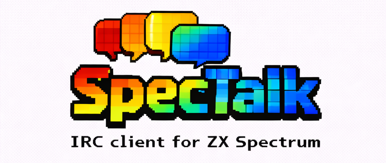
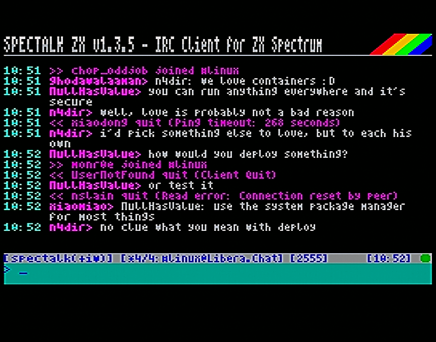
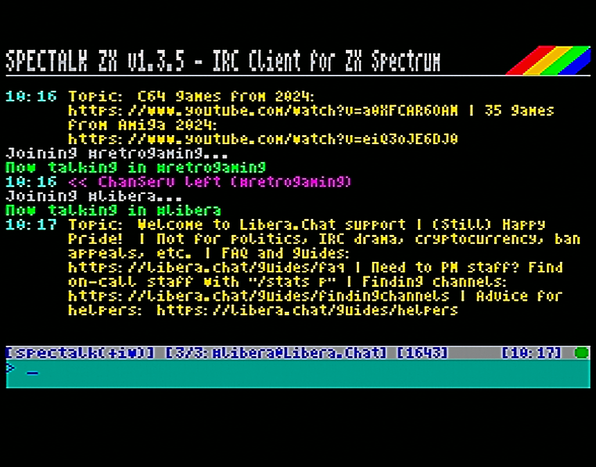
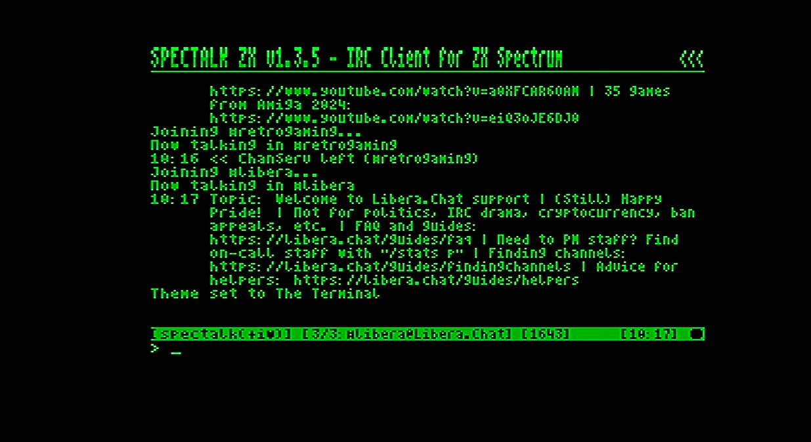
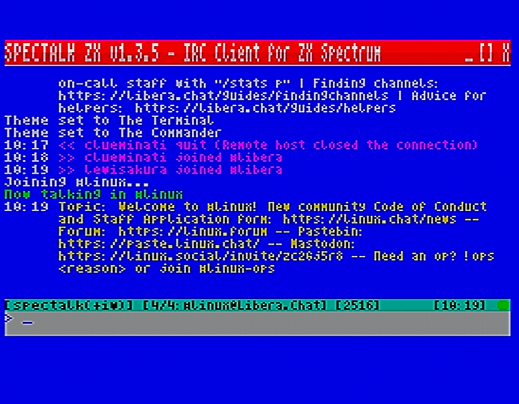

# SpecTalk ZX

**Cliente IRC para ZX Spectrum con WiFi ESP8266**

🇬🇧 [Read in English](README.md)


---

## Descripción

SpecTalk ZX es un cliente IRC completo para ZX Spectrum que trae la funcionalidad de chat moderno al hardware clásico de 8 bits. Utilizando un módulo WiFi ESP8266 para la conectividad, proporciona una experiencia IRC completa con una pantalla personalizada de 64 columnas y soporte para hasta 10 ventanas simultáneas de canales y mensajes privados.

---

## Características

### Pantalla e Interfaz
- **Pantalla de 64 columnas** con fuente personalizada de 4 píxeles para máxima densidad de texto
- **Interfaz multi-ventana** soportando hasta 10 canales/consultas simultáneas
- **3 temas de color**: Default (azul), Terminal (verde/negro), Colorful (cian)
- **Indicadores de actividad**: Marcadores visuales para ventanas con mensajes sin leer
- **Resaltado de menciones**: Ventanas con menciones de tu nick mostradas en color destacado
- **Indicador de conexión**: LED de tres estados (🔴 Sin WiFi → 🟡 WiFi OK → 🟢 Conectado)
- **Reloj en tiempo real** sincronizado vía SNTP
- **Timestamps opcionales** en todos los mensajes

### Protocolo IRC
- **Compatibilidad IRC completa**: JOIN, PART, QUIT, NICK, PRIVMSG, NOTICE, TOPIC, MODE, KICK, WHO, WHOIS, LIST, NAMES
- **Soporte CTCP**: VERSION, PING, TIME, ACTION
- **Integración con NickServ**: Identificación rápida con `/id` o automática con `nickpass=`
- **Sistema Away**: `/away` manual y `/autoaway` automático con temporizador de inactividad
- **Ignorar usuarios**: Bloquea mensajes de usuarios específicos con `/ignore`
- **Búsqueda de canales**: Encuentra canales o usuarios por patrón
- **Soporte UTF-8**: Caracteres internacionales convertidos a ASCII legible

### Conectividad
- **Auto-conexión**: Conecta automáticamente al servidor configurado al iniciar
- **Auto-identificación**: Identificación automática con NickServ tras conectar
- **Sistema de amigos**: Monitoriza hasta 5 amigos con notificaciones de estado online
- **Manejo de colisión de nick**: Nick alternativo automático si el primario está en uso
- **Sistema Keep-alive**: PING automático para detectar desconexiones silenciosas
- **Latencia de ping**: Medición del tiempo de respuesta del servidor

### Rendimiento
- **Arquitectura Unity Build**: Cliente completo compilado como unidad única para máxima optimización
- **Ring Buffer**: Buffer de 2KB para recepción de datos fiable a alta velocidad
- **Optimizado en ensamblador**: Rutas críticas de renderizado escritas en Z80 assembly
- **Drivers UART duales**: UART hardware (115200 baud) y bit-bang AY (9600 baud)

[](images/snap1.png)

---

## Requisitos de Hardware

| Componente | Especificación |
|------------|----------------|
| **Ordenador** | ZX Spectrum 48K, 128K, +2, +2A, +3, o compatible |
| **Módulo WiFi** | ESP8266 (ESP-01 o similar) con firmware AT |
| **Interfaz** | divMMC, divTIESUS, o adaptador UART basado en AY |

### Configuración de Velocidad

| Interfaz | Driver | Velocidad |
|----------|--------|-----------|
| divMMC / divTIESUS | UART Hardware | **115200** bps |
| ZX-Uno / Interfaz AY | Bit-bang AY-3-8912 | **9600** bps |

> ⚠️ **Importante**: Configura tu ESP8266 a la velocidad correspondiente a tu interfaz antes de usar.

---

## Instalación

1. Descarga el archivo TAP apropiado para tu hardware:
   - `spectalk_divmmc.tap` para divMMC/divTIESUS (115200 baud)
   - `spectalk_ay.tap` para interfaz AY (9600 baud)
2. Cárgalo en tu Spectrum mediante tarjeta SD, cinta u otro método
3. Configura las credenciales WiFi usando [NetManZX](https://github.com/IgnacioMonge/NetManZX) o herramienta similar

---

## Inicio Rápido

1. **Inicializar**: Al arrancar, espera a ver `WiFi:OK` en la barra de estado (el indicador pasa a amarillo, luego verde al conectar)

2. **Establecer nickname**:
   ```
   /nick TuNickname
   ```

3. **Conectar al servidor**:
   ```
   /server irc.libera.chat 6667
   ```

4. **Unirse a un canal**:
   ```
   /join #spectrum
   ```

5. **¡A chatear!** Escribe tu mensaje y pulsa ENTER

[](images/theme1.png) [](images/theme2.png) [](images/theme3.png)

---

## Referencia de Comandos

### Controles de Teclado

| Tecla | Acción |
|-------|--------|
| **ENTER** | Enviar mensaje o ejecutar comando |
| **EDIT** (Caps+1) | Limpiar línea de entrada / Cancelar búsqueda |
| **DELETE** (Caps+0) | Borrar carácter (retroceso) |
| **← / →** | Mover cursor en la línea de entrada |
| **↑ / ↓** | Navegar historial de comandos |

### Comandos de Sistema (!)

Comandos locales que no requieren conexión al servidor.

| Comando | Alias | Descripción |
|---------|-------|-------------|
| `!help` | `!h` | Mostrar pantallas de ayuda |
| `!status` | `!s` | Mostrar estado de conexión y estadísticas |
| `!init` | `!i` | Reinicializar módulo ESP8266 |
| `!config` | `!cfg` | Mostrar valores de configuración actuales |
| `!theme N` | — | Cambiar tema de color (1, 2 o 3) |
| `!about` | — | Mostrar versión y créditos |

### Comandos IRC (/)

#### Conexión

| Comando | Alias | Descripción |
|---------|-------|-------------|
| `/server host[:puerto]` | `/connect` | Conectar a servidor IRC (puerto por defecto: 6667) |
| `/nick nombre` | — | Establecer o cambiar nickname |
| `/pass contraseña` | — | Establecer contraseña del servidor (raramente necesaria) |
| `/id [contraseña]` | — | Identificarse con NickServ (usa contraseña guardada si no se indica) |
| `/quit [mensaje]` | — | Desconectar del servidor con mensaje opcional |

#### Canales

| Comando | Alias | Descripción |
|---------|-------|-------------|
| `/join #canal` | `/j` | Unirse a un canal |
| `/part [mensaje]` | `/p` | Salir del canal actual |
| `/topic [texto]` | — | Ver o establecer el tema del canal |
| `/names` | — | Listar usuarios en el canal actual |
| `/kick nick [razón]` | `/k` | Expulsar usuario del canal (solo ops) |

#### Mensajes

| Comando | Alias | Descripción |
|---------|-------|-------------|
| `/msg nick texto` | `/m` | Enviar mensaje privado |
| `/query nick` | `/q` | Abrir ventana de mensaje privado |
| `/me acción` | — | Enviar acción (aparece como *TuNick acción*) |
| `nick: texto` | — | Atajo: enviar PM a nick (sin /msg) |

#### Ventanas

| Comando | Alias | Descripción |
|---------|-------|-------------|
| `/0` ... `/9` | — | Cambiar a ventana por número (0 = servidor) |
| `/channels` | `/w` | Listar todas las ventanas abiertas (menciones resaltadas) |
| `/close` | — | Cerrar ventana actual |

#### Herramientas

| Comando | Alias | Descripción |
|---------|-------|-------------|
| `/search patrón` | — | Buscar canales (`#patrón`) o usuarios (`patrón`) |
| `/list` | `/ls` | Descargar lista completa de canales (usar con precaución) |
| `/who patrón` | — | Buscar usuarios que coincidan con el patrón |
| `/whois nick` | `/wi` | Obtener información sobre un usuario |
| `/ignore [nick]` | — | Alternar ignorar para nick, o listar ignorados |
| `/raw comando` | — | Enviar comando IRC crudo al servidor |

#### Estado Away

| Comando | Alias | Descripción |
|---------|-------|-------------|
| `/away [mensaje]` | — | Establecer estado away con mensaje, o quitar si no hay mensaje |
| `/autoaway N` | `/aa` | Auto-away tras N minutos inactivo (1-60, 0=desactivar) |

> **Comportamiento de auto-away**: Cuando está activado, te pone automáticamente away tras N minutos de inactividad. Enviar cualquier mensaje quita el auto-away automáticamente. El `/away` manual debe quitarse manualmente con `/away`.

#### Preferencias

| Comando | Alias | Descripción |
|---------|-------|-------------|
| `/beep` | — | Alternar sonido en mención de nick (on/off) |
| `/quits` | — | Alternar mostrar mensajes QUIT (on/off) |
| `/timestamps` | `/ts` | Ciclar modo de timestamps (off/on/smart) |
| `/autoconnect` | `/ac` | Alternar auto-conexión al iniciar (on/off) |
| `/tz [±N]` | — | Ver o establecer zona horaria (UTC -12 a +12) |
| `/friend [nick]` | — | Listar amigos, o alternar añadir/quitar un amigo (máx 5) |
| `/save` | `/sv` | Guardar configuración actual en tarjeta SD |

---

## Gestión de Ventanas

SpecTalk soporta hasta 10 ventanas simultáneas:

- **Ventana 0**: Mensajes del servidor (siempre presente)
- **Ventanas 1-9**: Canales y consultas privadas

### Navegación
- Usa `/0` a `/9` para cambiar de ventana
- Usa `/w` o `/channels` para ver todas las ventanas abiertas
- El indicador de actividad (●) muestra ventanas con mensajes sin leer
- El indicador de mención (!) muestra ventanas donde te mencionaron (resaltado en color)

### Mensajes Privados
- Los PMs entrantes crean automáticamente una ventana de consulta
- Usa `/query nick` para abrir manualmente un chat privado
- Usa `/close` para cerrar la ventana de consulta actual

---

## Archivo de Configuración

SpecTalk puede cargar ajustes desde un archivo de configuración en tu tarjeta SD. El archivo debe llamarse `SPECTALK.CFG` y estar en el directorio `SYS/CONFIG/`. Usa `/save` para escribir tu configuración actual en este archivo.

### Formato del Archivo

Archivo de texto plano con un ajuste por línea en formato `clave=valor`:

```
nick=MiNickname
server=irc.libera.chat
port=6667
nickpass=micontraseñanickserv
autoconnect=1
theme=1
timestamps=1
autoaway=15
beep=1
quits=1
tz=1
friends=Amigo1,Amigo2,Amigo3
ignores=Troll1,Troll2
```

### Ajustes Disponibles

| Ajuste | Descripción | Valores | Por defecto |
|--------|-------------|---------|-------------|
| `nick` | Nickname por defecto | Cualquier nick IRC válido | (ninguno) |
| `server` | Servidor IRC | Hostname o IP | (ninguno) |
| `port` | Puerto del servidor | 1-65535 | 6667 |
| `pass` | Contraseña del servidor | Cualquier string | (ninguno) |
| `nickpass` | Contraseña NickServ | Cualquier string | (ninguno) |
| `autoconnect` | Conectar al iniciar | 0 o 1 | 0 |
| `theme` | Tema de color | 1, 2, o 3 | 1 |
| `timestamps` | Mostrar timestamps | 0, 1, o 2 (smart) | 1 |
| `autoaway` | Minutos auto-away | 0-60 (0=off) | 0 |
| `beep` | Sonido en mención | 0 o 1 | 1 |
| `traffic` | Mostrar mensajes QUIT/JOIN | 0 o 1 | 1 |
| `tz` | Desplazamiento horario | -12 a +12 | 0 |
| `friends` | Nicks de amigos a monitorizar (separados por coma, máx 5) | nick1,nick2,... | (ninguno) |
| `ignores` | Nicks ignorados (separados por coma, máx 5) | nick1,nick2,... | (ninguno) |

### Ver Configuración Actual

Usa `!config` o `!cfg` para mostrar todos los valores de configuración actuales. Usa `/save` para guardar los cambios en la tarjeta SD.

---

## Barra de Estado

La barra de estado muestra:

```
[●] 12:34 [#canal(42)] [nick] [+modos]
```

| Elemento | Descripción |
|----------|-------------|
| **●** | Indicador de conexión: 🔴 Sin WiFi, 🟡 WiFi OK, 🟢 Conectado |
| **12:34** | Hora actual (sincronizada por SNTP) |
| **#canal(42)** | Nombre de ventana actual y número de usuarios |
| **nick** | Tu nickname actual |
| **+modos** | Tus modos de usuario (si los hay) |

Cuando estás away, el indicador cambia de un círculo sólido a un semicírculo.

---

## Compilación desde Código Fuente

### Requisitos
- **z88dk** con soporte SDCC
- **GNU Make**

### Comandos de Compilación

```bash
# Compilación estándar (divMMC/divTIESUS - 115200 baud)
make

# Compilación interfaz AY (9600 baud)
make ay

# Limpiar artefactos de compilación
make clean
```

El proyecto usa estrategia **Unity Build**: todos los fuentes C se compilan como una única unidad (`main_build.c`) permitiendo optimización agresiva entre funciones.

---

## Solución de Problemas

| Problema | Solución |
|----------|----------|
| El indicador permanece rojo | Verifica el cableado del ESP8266 y la configuración de velocidad |
| Indicador amarillo pero no conecta | Verifica las credenciales WiFi con NetManZX |
| "Connection timeout" tras inactividad | Comportamiento normal - keep-alive detectó conexión muerta |
| Los mensajes de un usuario no paran | Usa `/ignore nick` para bloquearlo |
| No puedo identificarme con NickServ | Usa `/id contraseña` o configura `nickpass=` en el archivo de configuración |
| Olvidé la configuración actual | Usa `!config` para ver todos los valores de configuración |
| Demasiados mensajes de quit | Usa `/quits` para desactivarlos |
| No hay sonido en menciones | Usa `/beep` para activar el sonido |
| Nick en uso al conectar | SpecTalk añade `_` automáticamente - usa `/nick` para cambiar después |
| Los caracteres acentuados se ven mal | UTF-8 se convierte automáticamente a equivalentes ASCII |

---

## Licencia

SpecTalk ZX es software libre publicado bajo la **GNU General Public License v2.0**.

Incluye código derivado de:
- **BitchZX** — Cliente IRC (GPLv2)
- **Driver UART AY/ZXuno** por Nihirash

---

## Autor

**M. Ignacio Monge García** — 2025-2026

---

## Agradecimientos

- Proyecto BitchZX por la base del protocolo IRC
- Nihirash por el código del driver UART AY
- Equipo z88dk por el toolchain del compilador cruzado
- Comunidad de retrocomputación del ZX Spectrum

---

*Conectando el ZX Spectrum a IRC desde 2025*
